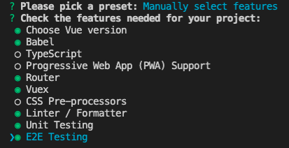
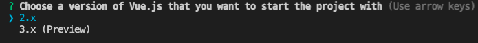
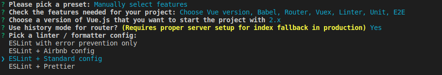
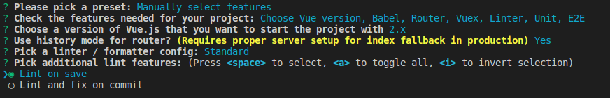
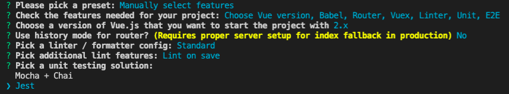
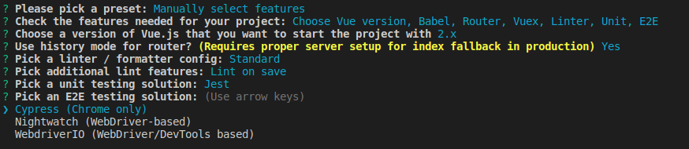
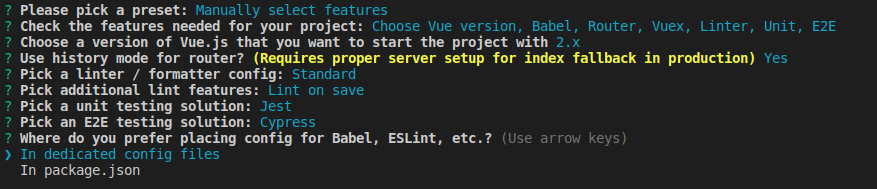
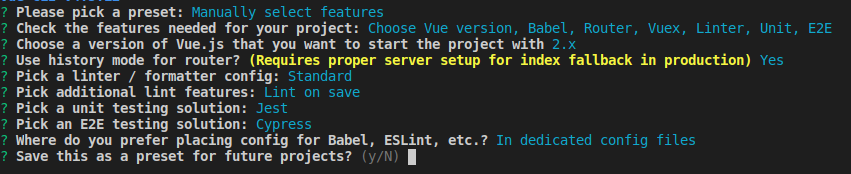

# Creando un proyecto usando CLI y framework UI

<div class="embed-responsive">
  <iframe
    class="embed-responsive__item"
    src="https://www.youtube.com/embed/opMGpx98r7c"
    title="YouTube video player"
    frameborder="0"
    allow="accelerometer; autoplay; clipboard-write; encrypted-media; gyroscope; picture-in-picture" allowfullscreen
  ></iframe>
</div>

Comenzaremos creando un proyecto a través de la línea de comandos de Vue. Si no la tienes puedes instalarla con el siguiente comando.

```bash
npm install -g @vue/cli
```

Una vez instalada, navegamos por la terminal hacia el directorio donde crearemos el proyecto y ejecutamos el siguiente comando:

```bash
vue create <nombre-de-tu-proyecto>
```

Durante el proceso debemos seleccionar las opciones que Vue CLI configurará por nosotros. Iremos paso a paso detallando el proceso de selección.

1) En primer lugar nos pregunta si queremos usar un *preset*, pero iremos a la última opción (utilizando las flechas del teclado) y presionamos *enter*. Esto nos permitirá seleccionar manualmente los plugins que usaremos.
   
   

2) En la siguiente etapa, utilizando la tecla `espacio`, agregaremos las opciones que puedes ver en la siguiente imagen.

   

3) Seleccionamos la versión 2 de Vue

   

4) En el siguiente paso seleccionar `Y` para configurar History mode en el router. Posteriormente haremos la configuración requerida en servidor en Express. Más detalles en [este link](https://router.vuejs.org/guide/essentials/history-mode.html#html5-history-mode)

   

>**Tip**: En las CLI la opción que se da con mayúscula es la opción por defecto. Por lo que puedes simplemente presionar enter 
si te pregunta (Y/n) y queremos seleccionar 'Y'

5) Utilizaremos la configuración de Javascript estándar para la herramienta [ESLint](https://eslint.org/). Si quieres conocer más detalles sobre este estándar puedes visitar [este link](https://standardjs.com/)  

   

6) Continuamos con lint on save para que las correcciones del linter ocurran de forma constante en la medida que desarrollamos  
   
   

7) En la parte de pruebas unitarias seleccionaremos [Jest](https://jestjs.io/) para crear pruebas de integración. Jest es un framework completo y eficiente para hacer pruebas (viene con *runner*, *aserciones* y trabaja con un *DOM virtual*).
   
   

8) Seleccionamos [Cypress](https://www.cypress.io/) para crear pruebas e2e. Cypress se está poniendo en duda varios de los paradigmas en torno a las pruebas de alto nivel. Cada vez es más rápido y barato hacer estas pruebas gracias a Cypress. 

   

9) Seleccionaremos la opción que nos permite que las configuraciones de las herramientas de desarrollo como `ESLint` tenga su propio archivo de configuración.
 
   

10) Finalmente damos enter para utilizar la opción por defecto.

   

Esto creará una carpeta con la estructura inicial y todo lo necesario para construir nuestra aplicación Frontend. Durante este proceso Vue CLI configuró [Webpack](https://webpack.js.org/). Webpack es una herramienta que nos permite tener códigos amigables para desarrollar y los trasforma en códigos amigables para el navegador. Esto lo logra aplicando una serie de transformaciones (*loaders*) cada vez de vemos nuestras aplicación ejecutándose en un navegador. Las configuraciones más importantes que hace Vue CLI son:

   +  Configurar el uso de *Single file components* (.vue) 
   +  Configurar Babel para las últimas versiones de ECMAScript
   +  Activar *Hot Module Replacement* en [webpack-dev-server](https://github.com/webpack/webpack-dev-server) para que al guardar los cambios se reflejen inmediatamente en el navegador


Una vez terminada la instalación ingresamos al repositorio recién creado y agregaremos [Vuetify](https://vuetifyjs.com/), una de las tantas bibliotecas de componentes UI de alta productividad para Vue (existen otras como Buefy, Element, Bootstrap Vue y otras), utilizando el siguiente comando:

```bash
vue add vuetify
```

> **Tip**: Decimos *repositorio* porque durante el proceso de instalación Vue CLI ejecutó `git init` por nosotros.

En este caso sí usaremos el *preset* recomendado por defecto, por lo que seleccionaremos la opción predeterminada como muestra la siguiente imagen:


Ya hemos instalado todo lo necesario para comenzar nuestro proyecto Frontend. Al correr el comando `npm run serve` e ir al navegador en la dirección `http://localhost:8080/` veremos lo siguiente:


Para finalizar este capítulo agregaremos los cambios hechos por Vuetify a Git. En esta guía usaremos el formato de [Conventional Commits](https://github.com/conventional-changelog/commitlint/tree/master/%40commitlint/config-conventional) para escribir los mensajes de los commits. Entonces vamos a la terminal y ejecutamos lo siguiente:

```bash
git add .
git commit -m "chore(set-up): Create a Vue project with Vue-CLI and Vuetify"

```
Listo! Ya estamos preparados para ir al siguiente capítulo y continuar con la construcción del proyecto.
