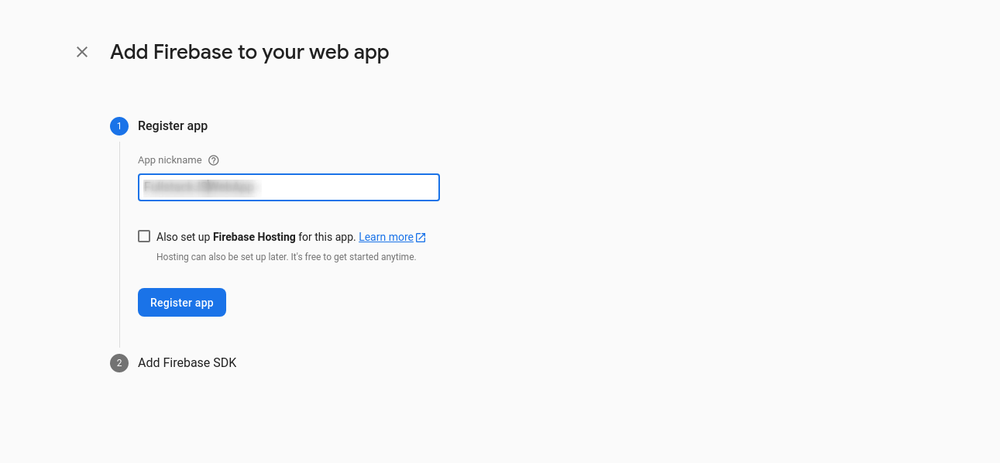

# Historias de usuario con BDD

<!-- <div class="embed-responsive">
  <iframe
    class="embed-responsive__item"
    src="https://www.youtube.com/embed/mRQrUuaRtdg"
    title="YouTube video player"
    frameborder="0"
    allow="accelerometer; autoplay; clipboard-write; encrypted-media; gyroscope; picture-in-picture" allowfullscreen
  ></iframe>
</div> -->

Vamos a desarrollar siguiendo la metodología Behaviour Driven Design (abreviada como BDD). Si quieres conocer más en detalle acerca de ella te recomendamos ver [este video](https://www.youtube.com/watch?v=_bGtaCvaHLE&t=2959s). En resúmen se trata de una metodología para que personas no técnicas describan lo que esperan del software utilizando historias de usuario, las cuales describen las interacciones que hace un cierto tipo de usuario y el resultado esperado.

Nuestra primera Historia de Usuario es la siguiente:

```ruby
Funcionalidad: Login de la aplicación

Escenario: Login con credenciales inválidas

Como un usuario no registrado
Cuando ingreso a la aplicación 
Y completo el campo username con 'info'
Y el campo password con 'visitor' 
Entonces debería permanecer en la misma página
```

  > Escribiremos esta Historia de Usuario utilizando directamente la API de Cypress, pero como detallamos en el curso, las Historias de Usuario se pueden transformar directamente en pruebas de aceptación utilizando conjuntamente la herramientas Cucumber y Cypress. 

Para implementar esta história de usuario vamos a modificar la prueba e2e que creó VueCLI. El archivo se llama `test.js`. Te puedes guiar por el siguiente esquema del proyecto:  

```
<tu-proyecto>
...
└─ public
└─ src
└─ tests
    └─ e2e
        └─ plugins
        └─ specs
            test.js <-- vamos a renombrar este archivo
        └─ support
    └─ unit
...
```
Renombramos el archivo test.js indicado en la figura anterior y lo llamaremos simplemente `login.js`.

Borramos su contenido y lo reemplazamos por la Historia de Usuario expresada en comandos de Cypress.

```javascript

describe('login test suite', () => {
  it('does not work with wrong credentials', () => {
    cy.visit('/')

    cy.get('[data-cy=username]').type('info')
    cy.get('[data-cy=password]').type('visitor')
    cy.get('[data-cy=login-btn]').click()

    cy.location('pathname').should('equal', '/') 
  })
})

```

### ¿Que significa este código?

¿Por qué utilizamos como selectores los atributos del tipo `data-cy=*`?. La respuesta está en un [artículo](https://docs.cypress.io/guides/references/best-practices#Selecting-Elements) del Blog oficial de Cypress. En resumen se hace para que las pruebas no estén acopladas a cambios que podría tener el diseño y afectar las pruebas si usamos los clásicos selectores por clases o id. 

Como no hemos escrito código, esta prueba de software fallará y será nuestro deber escribir el **mínimo código** necesario para hacerla pasar. Una vez que la prueba de software pase, debemos refactorizar el código (si aplica) y mantener la prueba pasando. A este ciclo se le conoce como  `Red - Green - Refactor`.

Para ver nuestra prueba fallando ejecutaremos el siguiente comando:

```shell
npm run test:e2e
```

Veremos el *runner* de Cypress en la siguiente ventana:


Al hacer click sobre `login.js` veremos la prueba de software fallando como muestra la siguiente imagen:


Veremos una ventana dividida verticalmente, al lado izquierdo están los pasos sucesivos que hemos escrito en la prueba de software y al derecho está el resultado de ejecutar esos pasos en nuestra aplicación.

Si vemos en detalle el panel izquierdo hay 2 instrucciones:

  ```
    1 VISIT /
    2 GET   [data-cy=username]
  ```
La primera instrucción hizo que nuestra aplicación navegará a la ruta raíz sin problemas, luego, la segunda instrucción intentó, sin éxito, encontrar en el HTML un elemento con el atributo `data-cy=username`. Esto lo vemos en el siguiente mensaje de error:

```
CypressError: Timed out retrying: Expected to find element: '[data-cy=username]', but never found it.
```

Al revisar el código veremos las dos (2) sentencias que ejecutaron las acciones del panel izquierdo:

```javascript
  cy.visit('/')
  cy.get('[data-cy=username]').type('info')
```

Vemos que el comando `cy.get` es usado para encontrar elementos HTML para luego encadenar acciones sobre ellos.

### ¿Cómo pasar la prueba?

Recordemos que la metodología propone que debemos pasar la prueba de software escribiendo el **menor código** posible. En este caso basta con agregar un input HTML que tenga el atributo `[data-cy=username]`. 

Para esto vamos al archivo `src/App.vue` y agregaremos el input especificado en la sección `<template>`, donde esta definido el elemento `<v-main>`

```html

  ...
  <v-main>
    <HelloWorld/>
    <!-- Este será el elemento que hará que la prueba deje de arrojar el error actual --->
    <input data-cy="username">
  </v-main>
  ...
```

Una vez agregado esto, guardamos el archivo y veremos que la terminal dirá `COMPILING`. Esperaremos que esto termine y vamos nuevamente a Cypress. Presionamos el botón para recargar las pruebas como se ve en al siguiente imagen.


Veremos como al lado derecho se refleja el input que agregamos y con valor ingresado por Cypress. Esto es por el comando `.type` que ejecutamos sobre el elemento seleccionado.

Y ahora veremos un mensaje de error diferente:

```
CypressError: Timed out retrying: Expected to find element: '[data-cy=password]', but never found it.
```

Si hacemos un análisis de lo que está escrito en la prueba de software podemos deducir que necesitaremos otro input esta vez con el atributo `[data-cy="password"]` y luego un botón con el atributo `data-cy="login-btn"`.

Al agregar esto en el archivo `views/App.vue` quedará así:


```html
  ...
  <v-main>
    <HelloWorld/>

    <input data-cy="username">
    <input data-cy="password">
    <button data-cy="login-btn">Ingresar</button>
  </v-main>
  ...
```

A continuación, al recargar las pruebas veremos que ahora está de color verde, indicando que la prueba pasó sin problemas.


### Refactorización

Si bien la prueba está pasando, vemos que la interfaz de usuario no cumple el objetivo. Los elementos están definidos sin estilo y aún tenemos todo el código que agregó Vuetify en su instalación. Modificaremos  esta vista para que ahora sea un de Login utilizando Vuetify. Mantendremos corriendo Cypress mientras refactorizamos, para que al terminar refresquemos las pruebas y nos aseguremos que sigan pasando.

Lo primero será simplificar el archivo `src/App.vue`. Reemplazaremos todo su contenido por lo siguiente:

```html
<template>
  <v-app>
    <v-main>
      <v-app-bar color="primary" dark>
        <v-toolbar-title>
          Proyecto Javascript Fullstack
        </v-toolbar-title>
        <v-spacer></v-spacer>
        <v-btn text to="/productos">Productos</v-btn>
        <v-btn text>Login</v-btn>
      </v-app-bar>
      <router-view></router-view>
    </v-main>
  </v-app>
</template>

<script> 
export default {
  name: 'App'
}
</script>

```

Luego iremos al directorio `views`. Eliminamos el archivo `About.vue` y cambiamos el nombre del archivo `Home.vue` por `Login.vue`. En cuanto guardemos estos cambios veremos un error en la terminal pero lo solucionaremos cuando actualicemos el router.

Ahora vamos al archivo `Login.vue` y reemplazaremos todo su contenido con lo siguiente:

```html
<template>
  <v-main class="home">
    <v-card width="400px" class="mx-auto my-auto">
      <v-card-title class="pb-0">
        <h1 class="mx-auto mb-5">Ingreso</h1>
      </v-card-title>
      <v-form ref="form">
        <v-text-field
          v-model="email"
          label="Correo"
          prepend-icon="mdi-account-circle"
          :rules="emailRules"
          validate-on-blur
          data-cy="username"
        />
        <v-text-field
          v-model="password"
          label="Contraseña"
          :type="showPassword ? 'text' : 'password'"
          :rules="passwordRules"
          validate-on-blur
          prepend-icon="mdi-lock"
          :append-icon="showPassword ? 'mdi-eye' : 'mdi-eye-off'"
          @click:append="showPassword = !showPassword"
          data-cy="password"
        />
      </v-form>
      <v-divider />
      <v-card-actions>
        <v-btn to="/registro" color="success"> Registro </v-btn>
        <v-spacer />
        <v-btn color="info" data-cy="login-btn" @click="login"> Ingresar </v-btn>
      </v-card-actions>
    </v-card>
  </v-main>
</template>

<script>

export default {
  data () {
    return {
      email: '',
      emailRules: [
        (v) => !!v || 'El correo es requerido',
        (v) => /.+@.+\..+/.test(v) || 'El correo debe tener formato válido'
      ],
      password: '',
      passwordRules: [(v) => !!v || 'La contraseña es requerida'],
      showPassword: false
    }
  },
  methods: {
    login () {}
  }
}
</script>

```
Ahora sí actualizamos  el *router* con los componentes que tenemos:

```javascript
import Vue from 'vue'
import VueRouter from 'vue-router'
import Login from '../views/Login.vue'

Vue.use(VueRouter)

const routes = [
  {
    path: '/',
    name: 'Login',
    component: Login
  }
]

const router = new VueRouter({
  mode: 'history',
  routes
})

export default router

```

Ahora recargamos las pruebas y siguen pasando, esta vez con la interfaz más acorde al objetivo de negocio que estamos desarrollando. El resultado será similar a la siguiente imagen:


## Integrando el servicio de autenticación de Firebase

Dado el contexto de nuestra aplicación, es decir, un desarrollo ágil con recursos muy limitados, cosa que ocurre muy frecuente,simplificaremos lo más posible el desarrollo de funcionalidades, por lo que por ahora, no desarrollaremos un sistema de registro, solo uno de autenticación. Esto ahorra trabajo y libera tiempo probar ideas de forma rápida y a bajo costo. Por lo que enviaremos invitaciones a los usuarios que publicarán productos directamente desde la interfaz de Firebase.  

>**Tip.** Por ahí dicen: "[Sencillez: el arte de maximizar la cantidad del trabajo no hecho - es esencial.](https://agilemanifesto.org/principles.html)"

Si ya tienes cuenta de Google, puedes iniciar sesión y dirigirte a [https://console.firebase.google.com/](https://console.firebase.google.com/), donde veremos un interfaz que es básicamente un CRUD de proyectos.


> **Tip!** Los proyectos permiten agrupar aplicaciones (web, IOs y Android) que pueden compartir recursos o servicios (algunos de pago a precios muy competitivos) como *Analytics*, *Firestore* (base de dato en tiempo real), *Cloud Functions* y *Cloud Messaging*. Con esto podríamos tener aplicaciones sincronizadas en distintas plataformas en tiempo real!!   


Una vez dentro del admin de Firebase hacemos click en crear un proyecto. Agregamos el nombre y deshabilitamos la opción de *Analytics*, como en la siguiente imágen:

. 

Cuando indique que el proyecto ha sido creado damos click en `continuar`. Posteriormente presionamos el botón  registrar nuestra aplicación de tipo Web:


Cuando lo presionemos nos solicitará otro nombre, esta vez para la aplicación web de nuestro proyecto (No selecciones la opción de Firebase Hosting) 



luego aparecerá lo siguiente:


Seleccionaremos el objeto de configuración y lo dejamos a mano.

A continuación crearemos el directorio `src/firebase` y al interior creamos 2 archivos; uno llamado `config.js` y otro `index.js`.

```
<tu-proyecto>
...
└─── public
└─── src
     ...
    └─── firebase
            config.js
            index.js

...
```
el contenido de ambos archivos será el siguiente:

**config.js**

Los datos de este archivo los copiaremos de lo indicado en la imagen anterior.
```javascript
export default {
  apiKey: '',
  authDomain: '',
  projectId: '',
  storageBucket: '',
  messagingSenderId: '',
  appId: ''
}

```

**index.js**

```javascript
import firebase from 'firebase/app'
import 'firebase/auth'
import config from './config'

const firebaseApp = firebase.initializeApp(config)

export { firebaseApp }

```

Ahora debemos instalar `firebase` en el proyecto. Para ello ejecutamos el siguiente comando en una terminal aparte para mantener corriendo Cypress:

```bash
npm install firebase
```

Con esto nuestro proyecto quedará preparado para conectarnos a Firebase llegado el momento.

Ahora volvemos a la interfaz de Firebase donde nos quedamos anteriormente y presionamos el botón `Ir a la consola`:


Finalmente habilitaremos la autenticación a través de correo electrónico/contraseña desde la consola de Firebase siguiendo estos pasos:

Presionamos desde el panel de control la opción `Authentication` como muestra la siguiente imagen:


Nos llevará a otra pantalla donde debemos presionar `Comenzar` y eso hará aparecer todas las opciones disponibles para la autenticación. Por defecto todos los tipos de autenticación vienen desactivados. Para habilitar la autenticación con correo electrónico/Contraseña  y presionamos el botón editar donde se indica:


Y finalmente habilitamos este servicio y presionamos "Guardar". Notar que mantenemos desactivada la opción `Vínculo del correo electrónico (acceso sin contraseña)


Ahora crearemos un usuario presionando el tab `Users` tal como se indica en la siguiente imagen:


Presionamos el Botón `Agregar usuario` y crearemos un usuario con el siguiente perfil:

```
Correo electrónico: test-e2e@boolean.cl
Contraseña: booleanacademia

```


Si quieres puede elegir otro correo electrónico y contraseña y reemplazarlo donde corresponda.
Indicamos que este usuario, a pesar de estár en entorno productivo, será solamente para realizar pruebas. 

### Nuevo escenario en la funcionalidad

Con el sistema de autenticación integrado podemos trabajar el siguiente escenario de la Historia de Usuario:

```ruby
Funcionalidad: login de la aplicación
...
Escenario: login con credenciales válidas

Como un usuario registrado
Cuando ingreso a la aplicación 
Y completo el campo username con 'test-e2e@boolean.cl'
Y el campo password con 'booleanacademia' 
Entonces debería ver la página de productos

```

Escribiremos una nueva prueba de software basada en la Historia de Usuario que consistirá en autenticarse en Firebase con los datos de prueba y validar que la aplicación nos lleve a la página `/productos`

Vamos a editar el archivo `tests/e2e/specs/login.js` y reemplazar su contenido por lo siguiente:

```javascript
describe('login test suite', () => {
  it('does not work with wrong credentials', () => {
    cy.visit('/')

    cy.get('[data-cy="username"]').type('info')
    cy.get('[data-cy="password"]').type('visitor')
    cy.get('[data-cy="login-btn"]').click()

    cy.location('pathname').should('equal', '/')
  })

  it('does work with valid credentials', () => {
    cy.visit('/')

    cy.get('[data-cy="username"]').type('test-e2e@boolean.cl')
    cy.get('[data-cy="password"]').type('booleanacademia')
    cy.get('[data-cy="login-btn"]').click()

    cy.location('pathname').should('equal', '/productos')
  })
})

```
Ahora recargamos Cypress y veremos el siguiente error:


Ahora vamos a escribir el código más simple que sea capaz de dejar pasando esta prueba. Vamos al archivo `src/views/Login.vue` y agregamos el siguiente contenido al método `login()`

```javascript
  ...
  methods: {
    login () {
      this.$router.push({ name: 'Products' })
    }
  }
  ...
```
Luego vamos a crear un nuevo archivo en `src/views` llamado `Products.vue` con el siguiente contenido:

```html
<template>
  <v-main>
    <h1>Productos</h1>
  </v-main>
</template>

<script>
export default {

}
</script>

```

Luego vamos al archivo `src/router/index.js` y reemplazamos su contenido por el siguiente:

```javascript
import Vue from 'vue'
import VueRouter from 'vue-router'
import Login from '../views/Login.vue'
import Products from '../views/Products.vue'

Vue.use(VueRouter)

const routes = [
  {
    path: '/',
    name: 'Login',
    component: Login
  },
  {
    path: '/productos',
    name: 'Products',
    component: Products
  }
]

const router = new VueRouter({
  mode: 'history',
  routes
})

export default router

```

Al recargar vemos que la nueva prueba si está pasando pero estos cambios provocaron que se cayera la prueba anterior:


Excelente! esto es lo que debería pasar en un flujo de trabajo guiado por pruebas de software: Los cambios ejecutados en el código eventualmente podrían afectar a otras pruebas por lo que es nuestro deber que el mínimo código que agregamos para pasar una prueba sea capaz de mantener todas las otras pruebas pasando y no sólo la que acabamos de escribir.

Para solucionar esto usaremos el atributo  `refs` que hemos asociado al elemento `v-form` para crear una función que valide si el formulario está correcto. A través de la `refs` obtendremos la instancia del elemento `v-form` y podremos utilizar su API para usar el método `validate`. Si quieres ver más detalle sobre la API de este elemento puedes visitar el [siguiente enlance](https://vuetifyjs.com/en/api/v-form/#functions-validate).

Iremos a modificar el archivo `src/views/Login.vue` y agregamos lo siguiente en la sección `methods`

```javascript
  ...
  methods: {
    validate () {
      return this.$refs.form.validate()
    },
    login () {
      if (this.validate()) {
        this.$router.push({ name: 'Products' })
      }
    }
  }
  ...
```

Al recargar las pruebas podemos ver como ambas están pasando. Excelente trabajo!

> **Tip**: Revisa la consola por errores de identación que puedan entorpecer la "compilación"

Ahora debemos hacer una refactorización para lograr una conexión real con el servicio de Firebase. Lo que haremos será modificar la sección `<script>` del archivo `src/views/Login.vue` por lo siguiente:

```javascript
<script>
import { firebaseApp } from '@/firebase'

export default {
  data () {
    return {
      email: '',
      emailRules: [
        (v) => !!v || 'El correo es requerido',
        (v) => /.+@.+\..+/.test(v) || 'El correo debe tener formato válido'
      ],
      password: '',
      passwordRules: [(v) => !!v || 'La contraseña es requerida'],
      showPassword: false
    }
  },
  methods: {
    validate () {
      return this.$refs.form.validate()
    },
    async login () {
      if (this.validate()) {
        await firebaseApp.auth().signInWithEmailAndPassword(this.email, this.password)
        this.$router.push({ name: 'Products' })
      }
    }
  }
}
</script>

```

Podemos notar como es que importamos el código de firebase que agregamos al comienzo de este capítulo. La función que efectúa la integración del logín es `signInWithEmailAndPassword` que puedes ver en la misma [documentación](https://firebase.google.com/docs/auth/web/password-auth#sign_in_a_user_with_an_email_address_and_password). Ahora al recargar las pruebas estas deberían seguir funcionando.


### Página de productos

Continuamos con con la siguiente Historia de Usuario. Esta vez con la vista de los productos.

```ruby
Funcionalidad: página de productos

Escenario: Listado simple

Como un usuario que inició sesión en la aplicación
Cuando ingreso a la página de productos
Entonces debería ver una lista de productos

```

Ahora escribiremos una prueba basada en la historia. Para esto crearemos un nuevo archivo en el directorio `tests/e2e/specs` y lo llamaremos `products.js`. Ahora agregaremos el siguiente contenido:


```javascript
describe('products test suite', () => {
  it('shows a list of products',() => {
    cy.visit('/')

    cy.get('[data-cy=username]').type('test-e2e@boolean.cl')
    cy.get('[data-cy=password]').type('booleanacademia')
    cy.get('[data-cy=login-btn]').click()

    cy.fixture('products.json')
      .then((products)=>{
        cy.get('[data-cy="product-item"]').should('have.length', products.length)
      });
  })
})

```
Si ejecutamos esta prueba veremos que falla por los *fixtures*, pero nos encargaremos de eso más adelante. 

En esta prueba vemos que es la tercera vez que escribimos las instrucciones para realizar una autenticación. Por suerte Cypress permite agrupar comandos comunes en funciones que podemos centralizar y reutilizar.
Para lograr esto iremos al archivo `tests/e2e/support/commands.js` y descomentaremos la linea indicada en la siguiente imagen:


y los reemplazaremos por lo siguiente:

```javascript
Cypress.Commands.add("login", (email, password) => {
  cy.visit('/')

  cy.get('[data-cy=username]').type(email)
  cy.get('[data-cy=password]').type(password)
  cy.get('[data-cy=login-btn]').click()  
})
```

y luego iremos a editar los archivos en el directorio `tests/e2e/specs` y reemplazaremos cada uno con el código correspondiente:

**login.js**

```javascript
describe('login test suite', () => {
  it('does not work with wrong credentials', () => {
    cy.login('info', 'visitor')

    cy.location('pathname').should('equal', '/')
  })

  it('does work with valid credentials', () => {
    cy.login('test-e2e@boolean.cl', 'booleanacademia')

    cy.location('pathname').should('equal', '/productos')
   })
});
```

**products.js**

```javascript
describe('products test suite', () => {
  it('shows a list of products',() => {
    cy.login('test-e2e@boolean.cl', 'booleanacademia')

    cy.fixture('products.json')
      .then((products)=>{
        cy.get('[data-cy="product-item"]').should('have.length', products.length)
      })
  })
})

```

Ahora cerraremos la ventana del navegador para volver al menu principal de Cypress en el cuál veremos incluido el nuevo archivo.

Ahora presionamos el botón que dice `Run all specs` que debería lucir como la siguiente imagen:


Y veremos el siguiente error:


### ¿Qué son los Fixtures ?

El error de la anterior prueba es porque aún no creamos el archivo `products.json`. Al revisar más en detalle notaremos que el método `fixture` es el que esta usando este archivo.

```javascript
cy.fixture('products.json')
  .then((products)=>{
    cy.get('[data-cy=product-item]').should('have.length', products.length)
  })

```

¿Para que agregamos este código?

Un `Fixture` es información estática que permite que las pruebas de software sean repetibles y verificables en el tiempo. En otras palabras es un estado fijo de la aplicación, que se carga a las pruebas. Son como la escenografía  para nuestros escenarios. En nuestro caso asumiremos la existencia de un archivo `products.json` que contendrá esta información. Este simple archivo estático cobra relevancia por que sirve de punto de encuentro entre las personas de negocio y los desarrolladores Backend y Frontend. 

Para saber dónde agregar *fixtures* a Cypres debemos verlo en el archivo `tests/e2e/plugins/index.js` y veremos entre otras configuraciones una relacionada a lo que buscamos:

```javascript
  fixturesFolder: 'tests/e2e/fixtures',
```
Esta línea de configuración define desde donde Cypress va a leer los archivos Fixture. Crearemos una carpeta llamada `fixtures ` en `tests/e2e` tal como lo indica el archivo de *plugins*. Dentro de esta nueva carpeta agregaremos un archivo llamado `products.json` con el siguiente contenido:

**products.json**

```json
[
  {
    "id": 1,
    "name": "Epiphone Explorer Gothic ",
    "description": "Guitarra color negro",
    "image": "https://images.unsplash.com/photo-1550985616-10810253b84d?ixlib=rb-1.2.1&ixid=MXwxMjA3fDB8MHxwaG90by1wYWdlfHx8fGVufDB8fHw%3D&auto=format&fit=crop&w=742&q=80",
    "code": "0001"
  },
  {
    "id": 2,
    "name": "Cordoba Mini Bass",
    "description": "Bajo pequeño tipo ukelele. Excelente sonido de bajo.",
    "image": "https://images.unsplash.com/photo-1556449895-a33c9dba33dd?ixid=MXwxMjA3fDB8MHxwaG90by1wYWdlfHx8fGVufDB8fHw%3D&ixlib=rb-1.2.1&auto=format&fit=crop&w=2734&q=80",
    "code": "0002"
  },
  {
    "id": 3,
    "name": "Distorsión Custom Badass 78",
    "description": "Peda del guitarra de distorsión.",
    "image": "https://images.unsplash.com/photo-1527865118650-b28bc059d09a?ixlib=rb-1.2.1&ixid=MXwxMjA3fDB8MHxwaG90by1wYWdlfHx8fGVufDB8fHw%3D&auto=format&fit=crop&w=668&q=80",
    "code": "0003"
  },
  {
    "id": 4,
    "name": "Distorsión TMiranda Bass Drive BD-1",
    "description": "Pedal del bajo de distorsión.",
    "image": "https://images.unsplash.com/photo-1614963590047-0b8b9daa3eb7?ixid=MXwxMjA3fDB8MHxwaG90by1wYWdlfHx8fGVufDB8fHw%3D&ixlib=rb-1.2.1&auto=format&fit=crop&w=2089&q=80",
    "code": "0004"
  },
  {
    "id": 5,
    "name": "Looper Hotone Wally",
    "description": "Pedal de looper. Super portable.",
    "image": "https://images.unsplash.com/photo-1595167151695-dfb4846e70f8?ixid=MXwxMjA3fDB8MHxwaG90by1wYWdlfHx8fGVufDB8fHw%3D&ixlib=rb-1.2.1&auto=format&fit=crop&w=668&q=80",
    "code": "0005"
  }
]

```

Ahora deberíamos obtener un nuevo error en Cypress, ya que la prueba esperaba encontrar cinco (5) elementos con el atributo `data-cy=product-item`, pero encuentra cero (0) como indica la siguiente imagen:


Al igual que las veces anteriores escribiremos el código más simple posible para pasar esta prueba.

Modificamos el archivo `src/views/Products.vue` y agregaremos lo siguiente en la sección `<template>`:

```html
<template>
  <v-main>
    <h1>Productos</h1>

    <section>
      
      
      
      
      
    </section>
  </v-main>
</template>
```

Guardamos, recargamos las pruebas en Cypress y veremos todas las pruebas en verde indicando que pasamos sin errores los casos:


Para la refactorización nos basaremos en el ejemplo de Vuetify presentado en el siguiente [enlace](https://vuetifyjs.com/en/components/images/#grid).

Modificamos completo el archivo `src/views/Products.vue` con el siguiente contenido:

```html
<template>
  <v-main>
    <h1 class="title-1 text-center my-5">Productos</h1>
    <section data-cy="products">
      <v-row>
        <v-col
          v-for="product in products"
          :key="product.id"
          cols="4"
          data-cy="product-item"
        >
          <v-card
            class="mx-auto"
            max-width="400"
          >
            <v-img
              :src="product.image"
              lazy-src="https://via.placeholder.com/300"
              aspect-ratio="1"
              class="white--text align-end"
              height="200px"
            >
            </v-img>
            <v-card-title>{{ product.name }}</v-card-title>
            <v-card-text>{{ product.description }}</v-card-text>
          </v-card>
        </v-col>
    </v-row>
    </section>
  </v-main>
</template>

<script>
export default {
  data () {
    return {
      products: [
        {
          id: 1,
          name: 'Epiphone Explorer Gothic ',
          description: 'Guitarra color negro',
          image: 'https://images.unsplash.com/photo-1550985616-10810253b84d?ixlib=rb-1.2.1&ixid=MXwxMjA3fDB8MHxwaG90by1wYWdlfHx8fGVufDB8fHw%3D&auto=format&fit=crop&w=742&q=80',
          code: '0001'
        },
        {
          id: 2,
          name: 'Cordoba Mini Bass',
          description: 'Bajo pequeño tipo ukelele. Excelente sonido de bajo.',
          image: 'https://images.unsplash.com/photo-1556449895-a33c9dba33dd?ixid=MXwxMjA3fDB8MHxwaG90by1wYWdlfHx8fGVufDB8fHw%3D&ixlib=rb-1.2.1&auto=format&fit=crop&w=2734&q=80',
          code: '0002'
        },
        {
          id: 3,
          name: 'Distorsión Custom Badass 78',
          description: 'Peda del guitarra de distorsión.',
          image: 'https://images.unsplash.com/photo-1527865118650-b28bc059d09a?ixlib=rb-1.2.1&ixid=MXwxMjA3fDB8MHxwaG90by1wYWdlfHx8fGVufDB8fHw%3D&auto=format&fit=crop&w=668&q=80',
          code: '0003'
        },
        {
          id: 4,
          name: 'Distorsión TMiranda Bass Drive BD-1',
          description: 'Pedal del bajo de distorsión.',
          image: 'https://images.unsplash.com/photo-1614963590047-0b8b9daa3eb7?ixid=MXwxMjA3fDB8MHxwaG90by1wYWdlfHx8fGVufDB8fHw%3D&ixlib=rb-1.2.1&auto=format&fit=crop&w=2089&q=80',
          code: '0004'
        },
        {
          id: 5,
          name: 'Looper Hotone Wally',
          description: 'Pedal de looper. Super portable.',
          image: 'https://images.unsplash.com/photo-1595167151695-dfb4846e70f8?ixid=MXwxMjA3fDB8MHxwaG90by1wYWdlfHx8fGVufDB8fHw%3D&ixlib=rb-1.2.1&auto=format&fit=crop&w=668&q=80',
          code: '0005'
        }
      ]
    }
  }
}

</script>

```
Notarás que hicimos una copia del contenido del archivo `products.json` que agregamos como fixture anteriormente. Esto será de utilidad ya que ahora nuestra aplicación implementa este acuerdo o pseudo-contrato con el *Negocio* y con el *Backend* y nuestra aplicación esta mostrando los atributos en función de esta lista.

Al recargar Cypress veremos que luego de hacer los cambios en el código nuestra prueba sigue pasando:


### Solicitudes al servidor: agregando Axios

Ya hemos escrito y pasado las pruebas necesarias para que nuestra aplicación permita mostrar una lista de productos luego de una autenticación. Pero la última prueba que escribimos la pasamos entregando una lista estática de productos. Ha llegado el momento de realizar una consulta a un servidor que nos entregue la información de los productos acorde al contrato JSON se nos entregó y alimentamos al sistema Fixtures.

Sin dejar de correr Cypress, abriremos una nueva terminal en el proyecto e instalaremos la bibliotecas `Axios` utilizando el siguiente comando:

```bash
npm install axios
```

Si quieres conocer más sobre su documentación te recomendamos mirar [este enlace](https://github.com/axios/axios#axios-api).


Ahora iremos al archivo `src/store/index.js` y reemplazaremos su contenido por lo siguiente:

```javascript
import Vue from 'vue'
import Vuex from 'vuex'
import axios from 'axios'

Vue.use(Vuex)

export default new Vuex.Store({
  state: {
    products: []
  },
  mutations: {
    SET_PRODUCTS (store, products) {
      store.products = products
    }
  },
  actions: {
    async getProducts (actionContext) {
      const { commit } = actionContext
      const productsURL = '/api/products'

      try {
        const response = await axios.get(productsURL)
        commit('SET_PRODUCTS', response.data)
      } catch (error) {
        console.log(error.message)
      }
    }
  },
  modules: {
  }
})

```

Con esto dejaremos lista una acción de `Vuex` que nos permitirá desde nuestro componente ejecutar la acción `getProducts` que agregará al estado de la aplicación los productos desde un servidor externo. El servidor deberá responder los productos basados en el contrato que consume nuestro componente `Products`.

Ahora iremos al archivo `src/views/Products.vue` y editaremos la sección `<script>` de la siguiente manera:

```html
<script>
import { mapActions, mapState } from 'vuex'

export default {
  computed: {
    ...mapState([
      'products'
    ])
  },
  methods: {
    ...mapActions([
      'getProducts'
    ])
  },
  created () {
    this.getProducts()
  }
}
</script>

```

Al recargar Cypress vamos a notar que las pruebas vuelven a fallar. 


Esto quiere decir que nuestro componente está tomando el valor por defecto desde el `store` y eso hace fallar las pruebas.

Si quieres entender mejor los `Lifecycle Hooks` como `created`,  que se ejecuta después que el componente ha sido creado, revisa el [siguiente enlace](https://v3.vuejs.org/api/options-lifecycle-hooks.html#created)

Y si quieres saber más de cómo el store de Vuex nos permite agregar acciones a los  componentes para ejecutarlas cuando sea necesario puedes ver [este enlace](https://vuex.vuejs.org/guide/actions.html#dispatching-actions-in-components)

Además en la imagen anterior vemos resaltado la petición al servidor que se hizo y que Cypress nos informa que ha recibido como respuesta un error de tipo `404`


```
(XHR) GET 404 /api/products

```

Esto es debido a que en nuestro componente realiza al inicializarse un llamado a la acción `getProducts` configurada en nuestro Store de Vuex. Esto lo podemos ver en el método `created()` del componente en `src/views/Products.vue`

```javascript
methods: {
  ...mapActions([
    'getProducts'
  ])
},
created () {
  this.getProducts()
}
```

Para que esta prueba pase necesitaremos un servidor que responda la petición a la url `http://localhost:8080/api/products`. ¿Como lograremos esto? Lo resolveremos en el siguiente capítulo.
