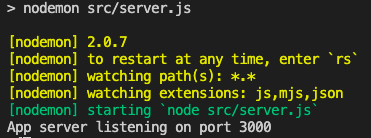
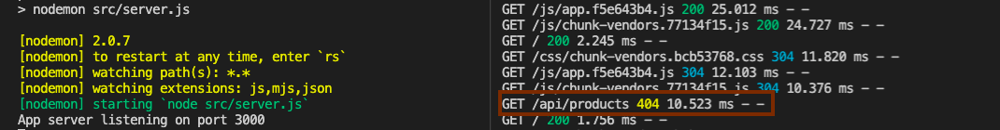
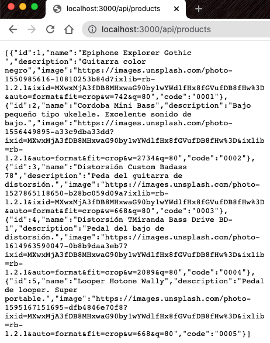

# Reorganización del proyecto como un repositorio monolítico y agregar Backend

<div class="embed-responsive">
  <iframe
    class="embed-responsive__item"
    src="https://www.youtube.com/embed/cPfpGxH9vtI"
    title="YouTube video player"
    frameborder="0"
    allow="accelerometer; autoplay; clipboard-write; encrypted-media; gyroscope; picture-in-picture" allowfullscreen
  ></iframe>
</div>


En función de la metodología que estamos utilizando (el mínimo código posible) lo que haremos será centralizar en este mismo repositorio todo lo necesario para que las pruebas pasen sin problema. En este caso las pruebas end-to-end requieren que desde el Frontend se realice una petición (request) hacia un backend que aún no existe. Este backend debe ser capaz de responder a una petición GET en la URL `/api/products`.

Dado este panorama, lo que haremos será reorganizar el repositorio siguiendo algunos lineamientos:

  - Dividiremos el repositorio en 2 dominios: Frontend y Backend. Cada dominio resolverá una parte del problema. En este caso el Frontend será la aplicación Web que interactúa con el usuario y el Backend entrega la información gestionando una Base de datos.
  - Crearemos un directorio en la raíz para centralizar todos los Fixtures que le serán útiles tanto al dominio de Backend como Frontend.
  - Cuando ambos dominios de negocio estén listos para salir a producción configuraremos procedimientos automáticos de calidad que validen la sintáxis  en todo el monorepo y que ejecuten las antes de que se suban cambios al repositorio remoto.

Cancelamos la ejecución de Cypress (cmd+C o ctrl+C) y movemos todos los archivos y carpetas hacia `/frontend`, excepto el archivo .gitignore que permanece en la raíz, dejando el repositorio como indica el siguiente esquema: 


```
<tu-proyecto>
└─── backend
└─── frontend <-- acá movemos todo el código generado hasta el momento
  └─── node_modules
  └─── public
  └─── src
  └─── tests
      .browserslistrc
      .editorconfig
      .eslintrc.js
      babel.config.js
      cypress.json
      jest.config.js
      package-lock.json
      package.json
      README.md
      vue.config.js
.gitignore <-- Este archivo permanece en la raíz
```

Ahora tomaremos la carpeta fixtures que se encuentra en `frontend/tests/e2e` y la moveremos hacia la raíz. También aprovecharemos de crear un directorio `src` dentro de la carpeta `backend` que será donde escribiremos el código del servidor. Con todos los ajustes el proyecto debe quedar como en el siguiente esquema:


```
<tu-proyecto>
└─── fixtures
     products.json
└─── backend
  └─── src
└─── frontend 
  └─── node_modules
  └─── public
  └─── src
  └─── tests
      .browserslistrc
      .editorconfig
      .eslintrc.js
      babel.config.js
      cypress.json
      jest.config.js
      package-lock.json
      package.json
      README.md
      vue.config.js
.gitignore
```
La implementación de las validaciones automatizadas de linter y pruebas las dejaremos para más adelante, cuando ya tengamos listos los proyectos de Frontend y Backend.

Continuamos con el Backend. Lo primero que haremos será entrar al directorio `backend` desde la terminal y ejecutaremos lo siguiente:

```bash
npm init -f
npm i express 
npm i --save-dev nodemon
```
Ahora creamos un nuevo archivo en `backend/src` llamado `server.js` con el siguiente contenido:

**backend/src/server.js**
```javascript
const express = require('express')

const app = express()
const port = 3000

app.use('/api/products', (request, response) => {
  const statusCode = 200
  console.log(`GET with status code ${statusCode} in /api/products endpoint`);
  return response
    .status(statusCode)
    .json([])
})

app.listen(port, () => {
  console.log(`App server listening on port ${port}`);
})

```
Una vez ejecutado esto deberíamos ver el directorio `backend` de la siguiente forma

```
└─ backend
  └─ node_modules
  └─ src
     server.js
  package-lock.json
  package.json

```

Modificamos el `backend/package.json` y quedará de la siguiente forma:

```json
{
  "name": "backend",
  "version": "1.0.0",
  "description": "",
  "main": "index.js",
  "scripts": {
    "dev": "nodemon src/server.js",
    "test": "echo \"Error: no test specified\" && exit 1"
  },
  "keywords": [],
  "author": "",
  "license": "ISC",
  "dependencies": {
    "express": "^4.17.1"
  },
  "devDependencies": {
    "nodemon": "^2.0.7"
  }
}

```
Con esto ya podremos levantar el servidor preocupándonos de estar dentro del directorio `backend` ejecutamos:

```bash
npm run dev
```

Veremos que nuestro servidor ya está corriendo como en la siguiente imagen:



Ahora abriremos otra ventana de la terminal y nos dirigimos al directorio `frontend`. Una vez dentro ejecutamos nuevamente el comando para abrir Cypress y nuestra aplicación:

```bash
npm run test:e2e
```
Una vez veamos la interfaz de Cypress, presionamos el botón `run all specs` y veremos el siguiente error:


Esto es debido a que en los pasos anteriores movimos la carpeta `fixtures` desde su ubicación hacia la raíz del proyecto.
Para solucionar esto nos dirigimos al archivo `frontend/tests/e2e/plugins/index.js` y reemplazamos completamente su contenido:

```javascript
const path = require('path')

module.exports = (on, config) => {
  const fixturesFolder = path.join(path.resolve('.'), '../fixtures')

  return Object.assign({}, config, {
    fixturesFolder,
    integrationFolder: 'tests/e2e/specs',
    screenshotsFolder: 'tests/e2e/screenshots',
    videosFolder: 'tests/e2e/videos',
    supportFile: 'tests/e2e/support/index.js'
  })
}

```

Debido a que hicimos una modificación en una configuración de arranque de `Cypress`, debemos reiniciar su ejecución.

Una vez que este corriendo `Cypress` veremos que aún persiste un error y seguimos viendo un `GET 404 /api/products`.
En la siguiente imagen se muestra como tenemos 2 terminales corriendo. En la de Frontend (de Cypress) identificamos la llamada que está dando `error 404`:



A pesar de que ya tenemos un servidor que responde al endpoint `/api/products` con el método GET, nuestra aplicación hace la solicitud a `http://localhost:8080` y nuestro servidor corre en la url `http://localhost:3000`.

Para solucionar esto tendremos que una vez más detener la ejecución de Cypress, pero esta vez modificaremos la configuración de Vue (internamente configura webpack-dev-server). Para ello iremos al archivo `frontend/vue.config.js` y reemplazamos todo su contenido por lo siguiente:

```javascript
module.exports = {
  transpileDependencies: [
    'vuetify'
  ],
  devServer: {
    proxy: {
      '^/api': {
        target: 'http://localhost:3000'
      }
    }
  }
}
```
Esto permitirá que, mientras desarrollamos, las llamadas XHR al servidor sean redireccionadas hacia `localhost:3000`. Esto tiene sentido solo en el ambiente local de desarrollo ya que en producción las llamadas desde el Frontend hacia el Backend serán bajo el mismo dominio y puerto.

Ahora volvemos a correr el comando `npm run test:e2e` dentro de la carpeta `frontend`. Veremos como siguen fallando pero la respuesta de la llamada al servidor ahora dice `GET 200 /api/products` como se muestra en la siguiente imagen:


Y lo siguiente en la salida de la terminal del servidor:


Podemos ver que se hicieron 2 llamadas al endpoint `/api/products`. Esto es debido a que en la primera prueba de autenticación exitosa también se hace un llamado a la página de productos.

Ahora iremos al archivo `backend/src/server.js` y lo reemplazaremos por lo siguiente:

**backend/src/server.js**
```javascript
const express = require('express')

const app = express()
const port = 3000

app.use('/api/products', (request, response) => {
  const statusCode = 200
  const products = [
    {
      id: 1,
      name: 'Epiphone Explorer Gothic ',
      description: 'Guitarra color negro',
      image: 'https://images.unsplash.com/photo-1550985616-10810253b84d?ixlib=rb-1.2.1&ixid=MXwxMjA3fDB8MHxwaG90by1wYWdlfHx8fGVufDB8fHw%3D&auto=format&fit=crop&w=742&q=80',
      code: '0001'
    },
    {
      id: 2,
      name: 'Cordoba Mini Bass',
      description: 'Bajo pequeño tipo ukelele. Excelente sonido de bajo.',
      image: 'https://images.unsplash.com/photo-1556449895-a33c9dba33dd?ixid=MXwxMjA3fDB8MHxwaG90by1wYWdlfHx8fGVufDB8fHw%3D&ixlib=rb-1.2.1&auto=format&fit=crop&w=2734&q=80',
      code: '0002'
    },
    {
      id: 3,
      name: 'Distorsión Custom Badass 78',
      description: 'Peda del guitarra de distorsión.',
      image: 'https://images.unsplash.com/photo-1527865118650-b28bc059d09a?ixlib=rb-1.2.1&ixid=MXwxMjA3fDB8MHxwaG90by1wYWdlfHx8fGVufDB8fHw%3D&auto=format&fit=crop&w=668&q=80',
      code: '0003'
    },
    {
      id: 4,
      name: 'Distorsión TMiranda Bass Drive BD-1',
      description: 'Pedal del bajo de distorsión.',
      image: 'https://images.unsplash.com/photo-1614963590047-0b8b9daa3eb7?ixid=MXwxMjA3fDB8MHxwaG90by1wYWdlfHx8fGVufDB8fHw%3D&ixlib=rb-1.2.1&auto=format&fit=crop&w=2089&q=80',
      code: '0004'
    },
    {
      id: 5,
      name: 'Looper Hotone Wally',
      description: 'Pedal de looper. Super portable.',
      image: 'https://images.unsplash.com/photo-1595167151695-dfb4846e70f8?ixid=MXwxMjA3fDB8MHxwaG90by1wYWdlfHx8fGVufDB8fHw%3D&ixlib=rb-1.2.1&auto=format&fit=crop&w=668&q=80',
      code: '0005'
    }
  ]
  
  console.log(`GET with status code ${statusCode} in /api/products endpoint`)
  
  
  return response
    .status(statusCode)
    .json(products)
})

app.listen(port, () => {
  console.log(`App server listening on port ${port}`)
})

```

Como verás, al que en el cápitulo anterior en el Frontend, hemos copiado la lista del archivo `fixtures/products.json` para responder esa lista de productos.
Una vez guardemos el archivo `backend/src/server.js` veremos que la terminal donde está corriendo el servidor dice 

```bash
[nodemon] restarting due to changes...
[nodemon] starting `node src/server.js`
```

Así que nuestro servidor ya está actualizado. Ahora simplemente presionamos en botón recargar en Cypress y veremos que nuestras pruebas nuevamente están pasando.


Con esto ya tenemos nuestra plataforma funcionando. Pero aun nos quedan algunas cosas básicas por resolver. Una de ellas es la seguridad de nuestro servidor. Podemos corroborar que nuestro servidor no valida quién hace la petición escribiendo `http://localhost:3000/api/products` en el navegador. Veremos que la información está expuesta sin ningún método de autenticación.



En el siguiente capítulo solucionaremos esto permitiendo que la autenticación a Firebase nos entregue un Token de autorización que validaremos en el Backend y así darle seguridad a nuestro servidor.

Antes de ir al siguiente capítulo vamos a detener el código del servidor y de Cypress.
En cualquier de las ventanas de la terminal nos saldremos del directorio y vamos a la raíz del proyecto (importante para que git agregue todo incluyendo frontend, backend, fixtures, etc) y ejecutamos lo siguiente:

```bash
git add .
git commit -m "feature(products): se agrega Backend con un endpoint de productos para ser consumido desde el Frontend para completar la funcionalidad de listar productos y autenticarse en la aplicación"
```
Aún cuando tenemos el endpoint descubierto, es importante notar que nuestras historias de usuario están corroboradas mediante pruebas y tenemos, en ambiente de desarrollo, la funcionalidad completa (feature). En adelante lo que sigue es aumentar la calidad de nuestra aplicación para hacerla más segura y flexible a los cambios.


Echemos un vistazo al resumen de nuestras historias de usuario que representan toda la funcionalidad que hemos desarrollado hasta el momento:

```ruby
Funcionalidad: login de la aplicación

Escenario: login con credenciales inválidas

Como un usuario no registrado
Cuando ingreso a la aplicación 
Y completo el campo username con 'info'
Y el campo password con 'visitor' 
Entonces debería permanecer en la misma página

Escenario: login con credenciales válidas

Como un usuario no registrado
Cuando ingreso a la aplicación 
Y completo el campo username con 'test-e2e@boolean.cl'
Y el campo password con 'booleanacademia' 
Entonces debería ver la página de productos

```

```ruby
Funcionalidad: página de productos

Escenario: listado simple

Como un usuario que inició sesión en la aplicación
Cuando ingreso a la página de productos
Entonces debería ver una lista de productos

```
