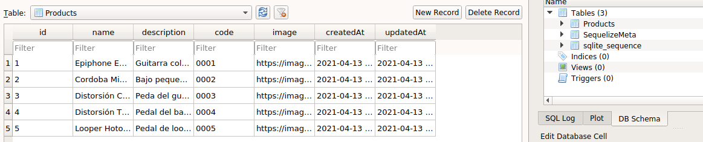

# Agregando base de datos en desarrollo

En esta sección configuraremos una opción muy común para persistir los datos que gestionará la aplicación. Nos referimos a las bases de datos relacionales, las que vienen en un montón de dialectos diferentes (psql, mysql, sqlite, oracle, etc), pero para no tener que decidir ahora cual usar, vamos a emplear una librería que nos entregará una capa de abstracción superior y que podemos configurar según las necesidades de cada entorno (desarrollo, producción, staging, etc). En el caso de Nodejs la librería más popular es `Sequelize`. Además de ser un traductor para los diferentes motores específicos de bases de datos, Sequelize es un ORM que entrega muchas facilidades para mantener sincronizada nuestra aplicación con el modelo de datos.

Para usar Sequelize nos aseguramos de navegar en la carpeta `backend` y ejecuraremos los siguientes comandos:

```bash
npm i sequelize
npm i sequelize-cli sqlite3 --save-dev
```

Con estos comandos hemos agregado `Sequelize` como dependencia general y `Sequelize-cli` y `Sqlite3` como dependencias de desarrollo. Estás últimas nos permitirán modelar de forma más ágil y ligera nuestras bases de datos de desarrollo. Más adelante, cuando estemos próximos al despliegue a producción seleccionaremos y configuraremos la base de datos para el ambiente productivo.

Para no tener que instalar el CLI de Sequelize en forma global, podemos exponer el comando desde el mismo directorio node_modules del proyecto y así usarlo de forma local. Para eso hay que modificar el archivo `backend/package.json` de la siguiente forma:

```javascript
 ...
  "scripts": {
    "start": "nodemon src/server.js",
    "sequelize": "sequelize", 
    "test": "echo \"Error: no test specified\" && exit 1"
  },
...
```
Sequelize-cli por defecto creará los modelos y las migraciones en la carpeta raíz, pero para definir que estos archivos se creen dentro del directorio `backend/src` (debido a la estructura de directorio que estamos utilizando) debemos configurarlo mediante un archivo denominado `.sequelizerc` en la carpeta `backend` con el siguiente contenido:

```javascript
const path = require('path')

module.exports = {
 'config': path.resolve('./src/config', 'config.json'),
 'models-path': path.resolve('./src/models'),
 'seeders-path': path.resolve('./src/seeders'),
 'migrations-path': path.resolve('./src/migrations')
}

```
Ahora podemos ejecutar en la terminal de Backend el siguiente  comando:

```bash
npm run sequelize init
``` 

Esto creará las carpetas `/config`, `/models`, `/config` y `/seeders` dentro del directorio `backend/src`. Este último luego de los comandos que hemos ejecutado debería verse como el siguiente esquema:

```bash
<backend>
├── node_modules
├── src
    ├── config
    ├── migrations
    ├── models
    ├── seeders
        server.js
.sequelizesrc
firebase-service-account.json
nodemon.json
package-lock.json
package.json
```

Ahora continuaremos el desarrollo modificando el dialecto en el entorno de desarrollo. Por defecto es `mysql` pero usaremos `sqlite` debido a que es más simple de mantener. Para esto modificamos el archivo `backend/src/config/config.json`

```javascript
"development": {
    "username": "root",
    ...
    "host": "local.database.sqlite3",
    "dialect": "sqlite"
  },
```
Ya estamos en condiciones de crear el primer modelo. En este caso crearemos el modelo `Product` con los atributos acordados en los Fixtures. En la terminal del backend ejecutaremos el siguiente comando.

```javascript
npm run sequelize model:generate -- --name Product --attributes name:string,description:string,code:string,image:string
```

Como profundizamos en el curso, la estructura de la base de datos debe ser modificada utilizando scripts de migración.
El comando anterior creó un script que agrega una tabla con el nombre del modelo más los atributos como columnas. Sequelize agrega por defecto el atributo id de típo numérico autoincremental y considera el caso de los atributos `created_at` y `updated_at`. El valor por defecto de estos dos atributos debemos establecerlo nosotros. 
Modificaremos el archivo de migración en `backend/src/migrations/[timestamp-generado-por-sequelize]-create-product.js` reemplazando el valor de ambos campos con lo que sigue:

```javascript
    createdAt: {
      allowNull: false,
      type: Sequelize.DATE,
      defaultValue: Sequelize.literal("CURRENT_TIMESTAMP"), 
    },
    updatedAt: {
      allowNull: false,
      type: Sequelize.DATE,
      defaultValue: Sequelize.literal("CURRENT_TIMESTAMP"),
    }
```
 Para que esta migración modifique la estructura, debemos ejecutar el archivo de migración con el siguiente comando:

`npm run sequelize db:migrate`

Para cargar los datos iniciales en el ambiente de desarrollo creamos un archivo conocido como Seed con el siguiente comando: 

`npm run sequelize seed:generate -- --name load-products`

Esto tan solo crea un archivo dentro de la carpeta `/seeders` que con simple javascript permite ingresar datos a nuestras tablas. Reemplazaremos todo el contenido del archivo creado. El nombre del archivo es:  `backend/src/seeders/[timestamp-generado-por-sequelize]-load-products.js`

```javascript
const path = require('path')
const fixturesFolder = path.join(path.resolve('.'), '../fixtures')
const products = require(`${fixturesFolder}/products.json`)

const tableName = 'Products';

module.exports = {
  up: async (queryInterface) => {
    await queryInterface.bulkDelete(tableName, null, { truncate: true })
    await queryInterface.bulkInsert(tableName, products, {})
  },
  down: async (queryInterface) => {
    await queryInterface.bulkDelete(tableName, null, { truncate: true })
  }
}

```

Al ejecutar el siguiente comando estamos copiando los datos definidos en los fixtures a la base de datos de desarrollo.

`npm run sequelize db:seed:all`

Es importante notar, que a pesar de que es posible ingresar datos a la base de muchas formas, es mejor seguir esta, ya que los fixtures representan una parte importante del modelo de datos y representan el acuerdo común entre Backend, Frontend y el Dominio de Negocio de nuestra aplicación.

Podemos notar que en la raíz del directorio `backend` se creó un archivo llamado `local.database.sqlite3`. Si contamos con un visor de bases de datos sqlite, podemos cargar este archivo y ver gráficamente el resultado como en la siguiente imágen:


  
Recomendamos `DB Browser for SQLite` que lo puedes encontrar en el [siguiente enlace](https://sqlitebrowser.org/dl/)

Ahora agregaremos el archivo `local.database.sqlite3` a  `.gitignore` que hasta el momento debería verse de la siguiente manera:

```
.DS_Store
node_modules
dist

/tests/e2e/videos/
/tests/e2e/screenshots/

firebase-service-account.json
local.database.sqlite3

# local env files
.env.local
.env.*.local

# Log files
npm-debug.log*
yarn-debug.log*
yarn-error.log*
pnpm-debug.log*

# Editor directories and files
.idea
.vscode
*.suo
*.ntvs*
*.njsproj
*.sln
*.sw?

```

Con todo esto ya tenemos nuestro ambiente de Base de datos montado en el ambiente de desarrollo. Solo falta incorporar que la respuesta del servidor entregue los datos desde la BDD 

#### Agregar modelos de base de datos como respuesta a la llamada al Servidor

 Volveremos a dividir nuestro entorno de trabajo en 2 ventanas (o pestañas) de la terminal. Una para el Frontend y otra para el Backend como lo hemos venido haciendo hasta el momento.
  - Primero para el Backend ejecutamos `npm run dev`
  - Luego para el Frontend ejecutamos `npm run test:e2e` y presionamos el botón `Run all specs` en la interfaz de Cypress.

Todas las pruebas deberían estar pasando sin problemas.

Ahora modificaremos el archivo `backend/src/server.js` y lo reemplazaremos todo su contenido por lo siguiente:

```javascript
const express = require('express')
const admin = require('firebase-admin')
const Models = require('./models')

const app = express()
const port = process.env.PORT
const environment = process.env.NODE_ENV

admin.initializeApp({credential: admin.credential.applicationDefault()})

app.use('/api', async (request, response, next) => {
  const headerToken = request.headers.authorization;
  if (!headerToken) {
    return response.status(401).json({ message: "No token provided" })
  }

  const [authorizationType, tokenValue] = headerToken.split(" ")

  if (headerToken && authorizationType.toLowerCase() !== "bearer") {
    return response.status(401).json({ message: "Invalid token" })
  }

  try {
    await admin.auth().verifyIdToken(tokenValue)
    next()

  } catch (error) {
    console.error(error.message)

    response
      .status(403)
      .json({ message: "Could not authorize" })
  }
})

app.use('/api/products', async (request, response) => {
  let statusCode = 200
  const Product = Models.Product;
  
  try {
    const products = await Product.findAll()

    console.log(`GET with status code ${statusCode} in /api/products endpoint`);

    return response
      .status(statusCode)
      .json(products)

  } catch (error) {
    const { message } = error;
    statusCode = 500;

    console.error(`GET with status code ${statusCode} in /api/products endpoint. Error: ${message}`)
    
    return response
      .status(statusCode)
      .json({ message })
  }
})

app.listen(port, () => {
  console.log(`App server listening in mode ${environment} on port ${port}`);
})

```
Hicimos una refactorización del archivo `backend/server.js` en el cual normalizaremos el uso de `async/await` para ejecutar Promesas y agregaremos un bloque `try/catch` para realizar una consulta a la base de datos para traer todos los productos utilizando los modelos de Sequelize y utilizando el método `Product.findAll`

Cuando guardemos el archivo se recargará Nodemon y ahora podemos volver a recargar las pruebas y veremos que siguen pasando.
Notaremos que ahora en la terminal la consulta a la base de datos aparece en la terminal como muestra la siguiente imagen:


Esto es Sequelize en acción realizando consultas SQL a la base de datos por nosotros. En ambiente de desarrollo es deseable poder ver las consultas que se van ejecutando, pero por seguridad y confidencialidad no es algo permitido en el entorno de producción. Esto debemos tenerlo presente en el paso a producción.

Ya es momento de un nuevo commit. Debemos detener Frontend y Backend. Volvemos a la raíz del proyecto y escribimos lo siguiente en la terminal:

```bash
git add .
git commit -m "refactor(backend-sequelize): Se agregó Sequelize para el manejo de modelos, migraciones y el ambiente de desarrollo para la base de datos"
```

Con esto ya tenemos completa la funcionalidad de nuestra aplicación conectados a una Base de datos.
En el próximo cápitulo escribiremos pruebas de software de integración tanto en Backend como Frontend de manera de asegurar que la calidad de la solución que hemos escrito no se vea afectada con las sucesivas modificaciones que se hagan en el futuro.

<table>
  <tr>
    <th colspan="2">
      <a href="./04-firebase-sdk-backend.md">
        <span>⬅️ </span>
        Validar autenticación en el Backend
      </a>
    </th>
    <th colspan="2">
      <a href="./06-testing-frontend-backend.md">Pruebas de software para Backend y Frontend
        <span>➡️ </span>
      </a>
    </th>
  </tr>
</table>


