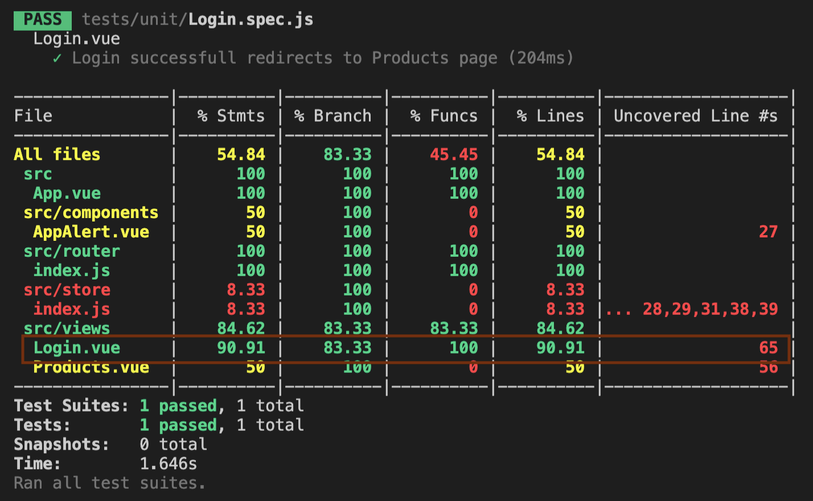
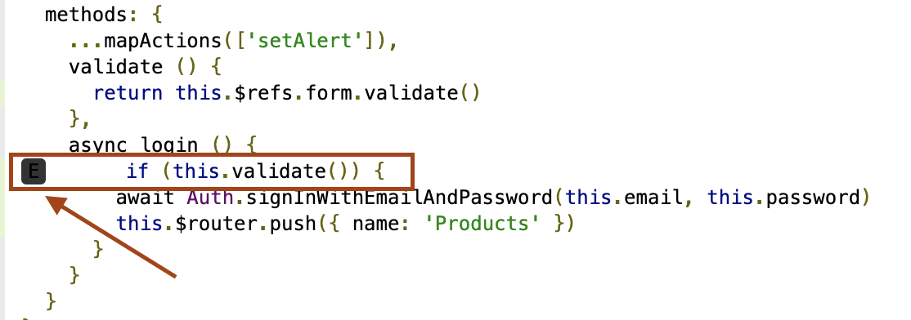
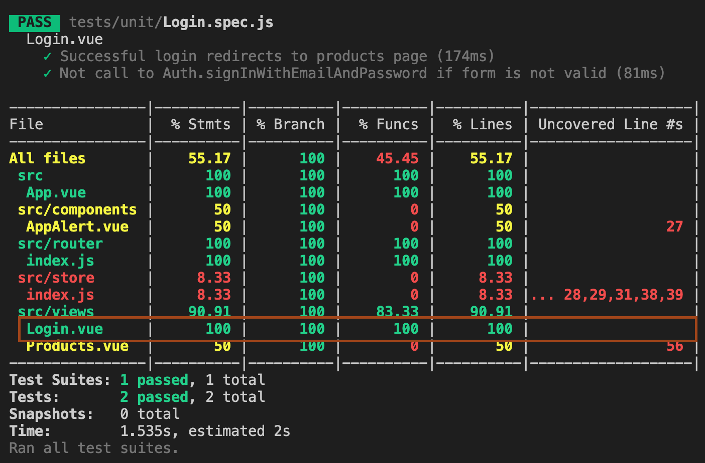
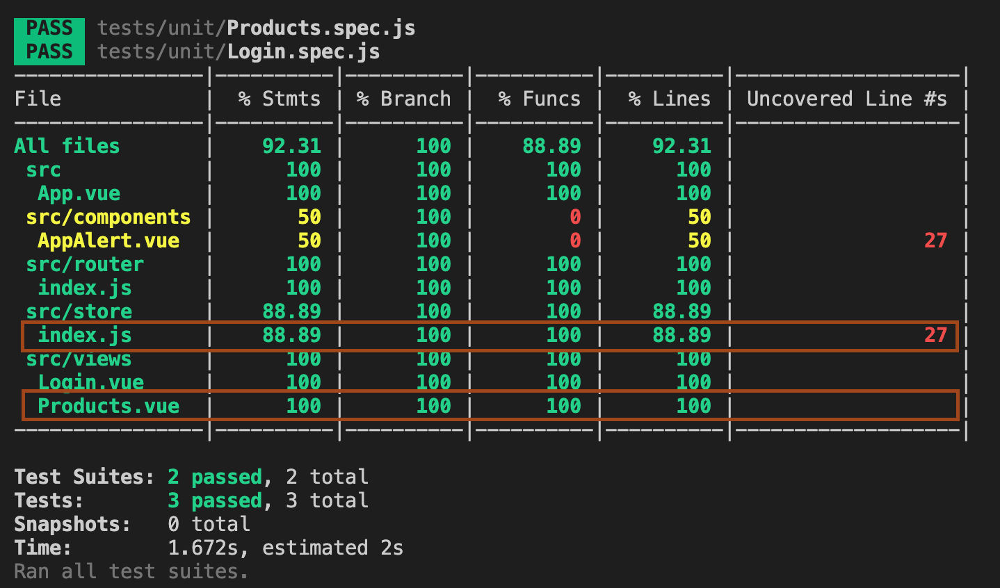
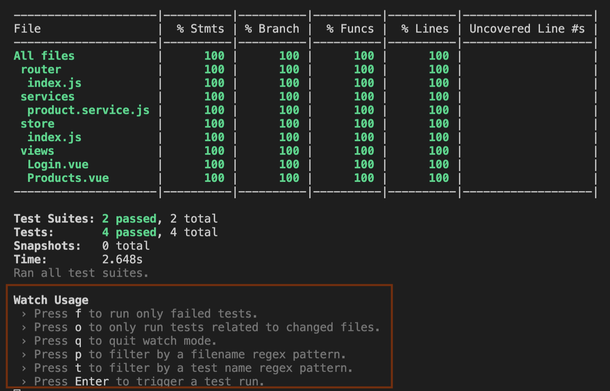
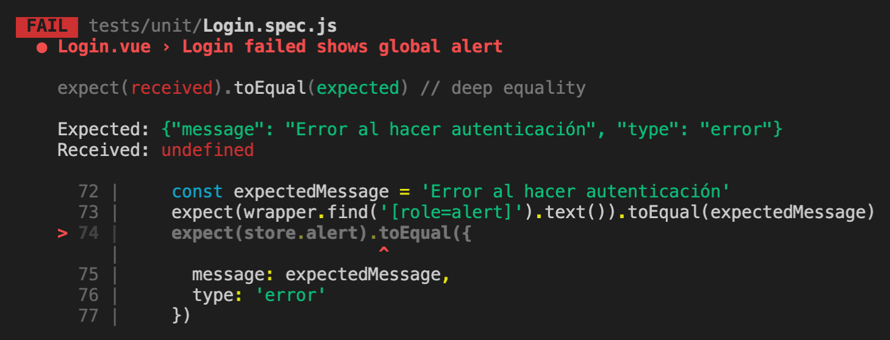

# Refactorización utilizando pruebas de software en Frontend
Continuamos caracterizando la aplicación para refactorizar y dejar la aplicación más flexible y mantenible. 

A diferencia de las pruebas que escribimos para el Backend, nuestra parte Frontend utiliza el framework VueJS y algunos plugins como Vuex y Vuetify. Esto agrega más de dificultad al momento de escribir las pruebas dado que debemos simular en cada una de ellas como si una aplicación Vue real estuviera funcionando incluyendo todas las cosas que configuramos.
Para facilitar las cosas Vue ya trae integrada una librería llamada `@vue/test-utils` que nos permitirá hacer algunas cosas necesarias para ejecutar las pruebas. Si quieres aprender mucho más en profundidad como funciona y que cosas se pueden hacer puedes revisar [este enlace](https://github.com/vuejs/vue-test-utils/)

Vuetify al ser una de las librerías que más usamos debido a que está incluida en todas las vistas de nuestra aplicación, necesita de una configuración especial para funcionar. El detalle y varios ejemplos de como hacer esto lo puedes revisar en la [sección dedicada a pruebas de software de la documentación de Vuetify](https://vuetifyjs.com/en/getting-started/unit-testing/)

En resumen debemos configurar las pruebas para que se incluya globalmente en cada prueba. 
Tenemos que hacer dos pasos para esto. El primero es modificar el archivo `frontend/jest.config.js` para que quede así:

```javascript
module.exports = {
  preset: '@vue/cli-plugin-unit-jest',
  setupFilesAfterEnv: [
    './jest.setup.js'
  ]
}

```

A continuación hay que crear el archivo `jest.setup.js` en la raíz del directorio `frontend` con el siguiente contenido

```javascript
import Vue from 'vue'
import Vuetify from 'vuetify'

Vue.use(Vuetify)
```

Aprovecharemos de incluir la opción para analizar la cobertura de las pruebas de software modificando el archivo `package.json` en su sección `scripts`:

```javascript
"test:unit": "vue-cli-service test:unit --coverage"
```

Una vez configurado esto comenzaremos a escribir las pruebas. 
#### Casos de la funcionalidad para definir pruebas 
En estos momentos el Frontend cuanta con las siguientes características

- Una vista `Login`  con un formulario con Vuetify que como finalidad ejecutar una función `login` que a su vez llama al método de autenticación de Firebase. En caso de ser exitoso, se redirige a la página de productos.

El resúmen de ese código lo vemos en la siguiente imagen.
**frontend/views/Login.vue**

```javascript
...

async login () {
  if (this.validate()) {
    // Caso 1: Para un formulario válido ir a la página de productos si la autenticación fue exitosa
    await Auth.signInWithEmailAndPassword(this.email, this.password)
    this.$router.push({ name: 'Products' })
  }
  // Caso 2: Para un formulario inválido NO llamamos al método de autenticación
}
```

- También tenemos una vista llamada `Products` que al montarse en el DOM, invoca una acción de Vuex que desencadena que se guarde en el estado una variable llamada `products` con la lista de productos provenientes del servidor. Cuando este valor del estado se actualiza, nuestra vista reacciona a esto mostrando la lista de elementos.

Lo vemos en el siguiente resumen
**frontend/src/views/Products.vue**
```javascript
...
computed: {
...mapState([
    'products'
  ])
},
methods: {
  ...mapActions([
    'getProducts'
  ])
},
created () {
  // Delegación de funcionalidad al store
  this.getProducts()
}
...
```

**frontend/src/store/index.js**
```javascript
actions: {
  async getProducts (actionContext) {
    const { commit } = actionContext
    const productsURL = '/api/products'

    try {
    // Caso 1: Al invocar a la acción getProducts al inicio de la vista se crea la lista de productos si el servidor responde exitosamente
    } catch (error) {
    // Caso 2: Al invocar a la acción getProducts al inicio de la vista NO se crea la lista de productos si el servidor responde con error
    }
  },
  ...
```

#### Implementación de pruebas sobre la vista Login
Vamos a escribir las pruebas para los casos que describimos anteriormente.

##### Caso 1: Para un formulario válido ir a la página de productos si la autenticación fue exitosa

Resultado esperado
```
Al resolverse la promesa del método Auth.signInWithEmailAndPassword llama al método $router.push 
```

La implementación de estas pruebas las escribiremos en un nuevo archivo llamado `Login.spec.js` en la carpeta `frontend/tests/unit` con el siguiente contenido:

**frontend/tests/unit/Login.spec.js**
```javascript
import { mount, createLocalVue } from '@vue/test-utils'
import Vuetify from 'vuetify'
import flushPromises from 'flush-promises'

import App from '@/App.vue'
import store from '@/store'
import router from '@/router'
import { Auth } from '@/firebase'

jest.mock('@/firebase',()=> ({
  Auth: {
    signInWithEmailAndPassword: jest.fn()
  }
}))

describe('Login.vue', () => {
  let localVue
  let vuetify

  beforeEach(() => {
    localVue = createLocalVue()
    vuetify = new Vuetify()

    Auth.signInWithEmailAndPassword.mockReset()
    router.push('/')
  })

  it('Successful login redirects to products page', async () => {
    Auth.signInWithEmailAndPassword.mockResolvedValue()
    const wrapper = mount(App,{
      localVue,
      vuetify,
      store,
      router
    })
    wrapper.vm.$router.push = jest.fn()
    wrapper.find('[data-cy=username]').setValue('testlogin@boolean.cl')
    wrapper.find('[data-cy=password]').setValue('somepass')

    wrapper.find('[data-cy=login-btn]').trigger('click')
    await flushPromises()

    expect(wrapper.vm.$router.push).toHaveBeenCalledWith({ name: 'Products' })
  })
})

```

Elimina el `example.spec.js` que se creo junto con la aplicación. No lo usaremos.

Vemos que incluimos un bloque `beforeEach` que nos permitirá hacer algunas acciones comunes relativas a las pruebas que escribiremos como por ejemplo dobles de prueba para la autenticación y su correspondiente `mockReset` para así asegurarnos de cumplir el [principio FIRST](http://agileinaflash.blogspot.com/2009/02/first.html) manteniendo a cada una de las pruebas "aisladas" entre si.
Aprovechando que nuestras vistas están integradas con el enrutador de la aplicación, realizamos una navegación hacia la ruta `/` para asegurarnos que cuando la aplicación sea montada para las pruebas, se utilice la vista correcta.

Ahora al mirar la prueba vemos como podemos configurar que la promesa asociada que retorna el método `Auth.signInWithEmailAndPassword` se resuelva con ayuda de jest en la función `mockResolvedValue`, al ser llamada en el contexto de la aplicación Vue esta no se resolverá automáticamente. Para poder lograr esto utilizaremos la librería `flush-promises`.
Podemos ver una explicación desde la propia documentación de Vue relacionada a esto en [este enlace](https://vue-test-utils.vuejs.org/guides/testing-async-components.html#asynchronous-behavior-outside-of-vue)

Vamos a instalar esta librería ejecutando lo siguiente en nuestra terminal preocupándonos de navagar hasta el directorio `frontend` en nuestro proyecto:

```bash
npm install --save-dev flush-promises
```

Ahora ya estamos en condiciones de correr las pruebas que escribimos para la vista `Login.vue`. Al correr el comando `npm run test:unit` veremos lo siguiente:




Como vemos remarcado en la imagen aún no hemos abordado todos los casos para esta vista. Si vamos a la carpeta coverage que se debe haber creado en la raíz del directorio `frontend` y analizamos el archivo `frontend/src/Login.vue` veremos lo siguiente:



Esto quiere decir que necesitamos una prueba que cubra el caso en el cual se llama a la función `login` pero el formulario no es válido.

En adelante vamos a complementar este archivo agregando los bloques `it` dentro del bloque `describe` en el mismo orden que hicimos nuestro análisis
##### Caso 2: Para un formulario inválido NO llamamos al método de autenticación

Resultado esperado
```
NO se llama al Auth.signInWithEmailAndPassword
```

la implementación de la prueba sería la siguiente:

```javascript
it('Does not call Auth.signInWithEmailAndPassword if form is not valid', async () => {
  const wrapper = mount(App, {
    vuetify: new Vuetify(),
    store,
    router
  })
  wrapper.find('[data-cy=login-btn]').trigger('click')
  
  expect(Auth.signInWithEmailAndPassword).not.toHaveBeenCalled()
})
```
Ahora al volver a ejecutar las pruebas vemos como ya hemos abarcado el 100% de los casos para esta vista en la siguiente imagen:




Podemos notar que con estas 2 pruebas ya hemos abarcado casi la mitad de lo que hemos construido hasta el momento.
Nuestro enfoque será primero escribir pruebas de "alto nivel" que nos permitan abarcar la mayor cantidad de código posible de forma de tener una base de confianza que corrobore que al refactorizar escribiendo código mejor estructurado, la funcionalidad general de la aplicación se mantenga sin cambios.

El archivo `frontend/tests/unit/Login.spec.js` debería haber quedado de la siguiente forma:

```javascript
import { mount, createLocalVue } from '@vue/test-utils'
import Vuetify from 'vuetify'
import flushPromises from 'flush-promises'

import App from '@/App.vue'
import store from '@/store'
import router from '@/router'
import { Auth } from '@/firebase'

jest.mock('@/firebase',()=> ({
  Auth: {
    signInWithEmailAndPassword: jest.fn()
  }
}))

describe('Login.vue', () => {
  let localVue
  let vuetify

  beforeEach(() => {
    localVue = createLocalVue()
    vuetify = new Vuetify()

    router.push('/')
    Auth.signInWithEmailAndPassword.mockReset()
  })

  it('Successful login redirects to products page', async () => {
    Auth.signInWithEmailAndPassword.mockResolvedValue()
    const wrapper = mount(App,{
      localVue,
      vuetify: new Vuetify(),
      store,
      router
    })
    wrapper.vm.$router.push = jest.fn()
    wrapper.find('[data-cy=username]').setValue('testlogin@boolean.cl')
    wrapper.find('[data-cy=password]').setValue('somepass')

    wrapper.find('[data-cy=login-btn]').trigger('click')
    await flushPromises()

    expect(wrapper.vm.$router.push).toHaveBeenCalledWith({ name: 'Products' })
  })

  it('Does not call Auth.signInWithEmailAndPassword if form is not valid', async () => {
    const wrapper = mount(App, {
      vuetify: new Vuetify(),
      store,
      router
    })
    wrapper.find('[data-cy=login-btn]').trigger('click')
    
    expect(Auth.signInWithEmailAndPassword).not.toHaveBeenCalled()
  })
})

```
#### Implementación de pruebas sobre la vista Products

Pasaremos a hacer las pruebas para productos.

##### Caso 1: Al invocar a la acción getProducts al inicio de la vista se crea la lista de productos si el servidor responde exitosamente

Resultado esperado
```
Al resolverse la promesa de axios, la vista agrega los elementos en función de la cantidad de productos que provienen del servidor
```

La implementación de estas pruebas las escribieremos en un nuevo archivo llamado `Products.spec.js` en la carpeta `frontend/tests/unit` con el siguiente contenido:

**frontend/tests/unit/Products.spec.js**
```javascript
import { mount, createLocalVue } from '@vue/test-utils'
import axios from 'axios'
import flushPromises from 'flush-promises'
import Vuetify from 'vuetify'

import App from '@/App.vue'
import store from '@/store'                  
import router from '@/router'
import products from '../../../fixtures/products.json'

jest.mock('axios',() => ({
  get: jest.fn()
}))

jest.mock('@/firebase',() => ({
  Auth: {
    currentUser: { 
      name: 'dummyUser',
      getIdToken: () => 'fakeToken'
    }
  }
}))

describe('Product.vue',() => {
  let localVue
  let vuetify

  beforeEach(() => {
    localVue = createLocalVue()
    vuetify = new Vuetify()

    store.replaceState({
      products: []
    })
    axios.get.mockReset()
    router.push('/')
  })

  it('Shows a list of products when the server response successfully', async () => {
    const wrapper = mount(App,{
      localVue,
      vuetify,
      store,
      router
    })
    axios.get.mockResolvedValue({ data: products })
    
    router.push( { name: 'Products' } )
    await flushPromises()

    expect(wrapper.findAll('[data-cy=product-item]')).toHaveLength(products.length)
    expect(store.state.products).toEqual(products)
  })
})

```

Nos damos cuenta que las pruebas al igual que en el caso anterior requieren configuración como dobles de prueba (1 Mock y 1 Stub) y podemos notar como ahora en el bloque `beforeEach` incluimos `store.replaceState`. Esto lo deberemos hacer en cada prueba que tenga computada atributos del Store de Vuex para asegurarnos que el estado se reinicia en cada prueba y así estas se mantienen aisladas entre sí como recordamos en las pruebas de la vista anterior.

Si miramos la prueba notamos que en este caso como la llamada a la acción de Vuex que desencadena que se configure el valor del estado `products` se hace en el método del ciclo de vida `created` del componente, por esto forzamos a que esto ocurra navegando hacia la ruta de la página de productos a través del router utilizando `router.push`

Al correr las pruebas veremos lo que muestra la siguiente imagen:



Hemos marcado también el store porque sabemos nuestra vista interactúa con esta sección del código. Si analizamos el archivo de cobertura asociado a este veremos lo siguiente:


Resolveremos esto en el siguiente caso
##### Caso 2: Al invocar a la acción getProducts al inicio de la vista NO se crea la lista de productos si el servidor responde con error 

Resultado esperado
```
No se muestran productos en la lista cuando la llamada al servidor responde con error
```

```javascript
it('Shows an empty list of products when the server response failed', async () => {
  const wrapper = mount(App,{
    localVue,
    vuetify,
    store,
    router
  })
  const errorMessage = 'Database Error in Server'
  axios.get.mockRejectedValue(new Error(errorMessage))
  
  router.push( { name: 'Products' } )
  await flushPromises()

  expect(wrapper.findAll('[data-cy=product-item]')).toHaveLength(0)
  expect(store.state.products).toEqual([])
})
```

Ejecutamos las pruebas y veremos como hemos logrado cubrir todo el código como muestra la siguiente imagen:


#### Refactorización del Store

Con esto ya tenemos una capa de cobertura o caracterización completa del código que nos permite implementar la refactorización con mayor confianza. En el caso del framework Vue con Vuex es clásico que el `store` es la primera fuente de *code smells* y tenemos una oportunidad de extraer la llamada al servidor en un servicio independiente. Para esto creamos el directorio `services` dentro de `src` y ahora crearemos un archivo llamado `product.service.js` con el siguiente contenido:

**frontend/src/services/product.service.js**
```javascript
import axios from 'axios'
import { Auth } from '@/firebase'

const productsURL = 'api/products'

export default {
  async getProducts() {
    try {
      const token = await Auth.currentUser?.getIdToken(true)
      const headers = {
        Authorization: `Bearer ${token}`
      }
      const response = await axios.get(productsURL, { headers })
      return response.data
    } catch (error) {
      throw new Error('Productos momentáneamente no disponibles')
    }
  }
}

```

Y en el `store` quedaría así:

```javascript
import Vue from 'vue'
import Vuex from 'vuex'
import productService from '@/services/product.service'

Vue.use(Vuex)

export default new Vuex.Store({
  state: {
    products: []
  },
  mutations: {
    SET_PRODUCTS (store, products) {
      store.products = products
    }
  },
  actions: {
    async getProducts (actionContext) {
      const { commit } = actionContext
      try {
        const products = await productService.getProducts()
        commit('SET_PRODUCTS', products)
      } catch (error) {
        console.error(error.message)
      }
    }
  }
})

```

Ahora volvemos a ejecutar las pruebas y veremos que siguen pasando y que aún mantenemos la cobertura como muestra la siguien imagen:


#### Nueva funcionalidad a través de la metodología TDD

Escribiremos una nueva funcionalidad para nuestra aplicación. Antes de comenzar haremos una simulación de como se generaría la necesidad de programar algo nuevo en una aplicación si estuvieramos en el caso de una aplicación en la que hay un equipo multidisciplinario involucrado comenzando desde quienes solicitan el cambio hasta como lo hace el programador para describir lo que tiene que hacer y aprovecharemos esto para aplicar la metodolodía TDD: Desarrollo guiado por pruebas

**Descripción de la solución de alto nivel**

> Crear una alerta centralizada para toda la aplicación que debe mostrar información tanto de éxito como de error manteniendo el estilo visual actual

El texto anterior surge de una coordinación entre personas del área de UI, UX, Desarrolladores y roles de negocio en una empresa y que termina en manos de los programadores que debemos ser capaces de implementar estos requerimientos a partir de nuestro conocimientos en la tecnología que está escrita nuestra aplicación.

Cuando nos enfrentamos al desafío de implementar esta funcionalidad gracias a nuestro conocimiento en programación, conocimiento del Framework Vue y entendiendo como funciona el patrón de manejo de estados de Vuex, podríamos refinar más el requerimiento ahora en términos técnicos

**Descripción técnica**

>Lo que haremos será escribir un componente que nos permita mostrar una alerta central que se activará a partir de una propiedad que configuraremos en el store.
Para mostrar la alerta de forma central la agregaremos al componente App.vue que se conectará al estado y mostrará o no la alerta en función de si está la alerta o no asignada. El valor del estado lo llamaremos `alert` y su valor por defecto será `null`.
Para poder asignar una alerta en el estado expondremos una acción llamada setAlert para estos fines.
> En cuanto a la UI utilizaremos el componente `<v-alert>` que trae Vuetify y modelaremos la alerta como un objeto que tenga las propiedades `message` y `type`.

Si bien podemos tener una estrategia en mente y entender los conceptos de arquitectura del framework, tener ideas por sobre como resolverlo y probar todo esto directamente en la aplicación, lo que haremos será modificar nuestras pruebas para hacerlas fallar debido a que consultaremos sobre cosas que aún no están programadas y relacionadas a esta funcionalidad.


##### Modo TDD

Lo primero será agregar un nuevo script al archivo `frontend/package.json` en la sección correspondiente de la siguiente forma

```javascript
"tdd": "npm run test:unit -- --watchAll"
```

Ahora ejecutamos el comando `npm run tdd` y veremos algo como en la siguiente imagen:



Vemos que ahora la terminal está esperando que se hagan cambios ya sea en las pruebas o en el código fuente.

#### Implementación de la alerta cuando falla autenticación en vista Login

Comenzaremos por modificar las pruebas que ya habíamos escrito y así hacerlas fallar. Agregaremos una nueva prueba para la vista Login

**frontend/tests/unit/Login.spec.js**
```javascript
it('Login failed shows global alert', async () => {
  const wrapper = mount(App, {
    localVue,
    vuetify,
    store,
    router
  })
  const errorMessage = 'Invalid user'
  Auth.signInWithEmailAndPassword.mockRejectedValue(new Error(errorMessage))
  wrapper.find('[data-cy=username]').setValue('sebastian@boolean.cl')
  wrapper.find('[data-cy=password]').setValue('academiaboolean')
  
  wrapper.find('[data-cy=login-btn]').trigger('click')
  await flushPromises()

  const expectedMessage = 'Error al hacer autenticación'
  expect(wrapper.find('[role=alert]').text()).toEqual(expectedMessage)
  expect(store.state.alert).toEqual({
    message: expectedMessage,
    type: 'error'
  })
})
```
Al actualizarse las pruebas veremos un error como muestra la siguiente imagen:


Esto ocurre porque en la vista Login no capturamos las excepciones cuando ocurre un error en la función `Auth.signInWithEmailAndPassword`. Vamos a modificar esta vista en el archivo `frontend/src/views/Login.vue` reemplazando la función `login` por lo siguiente:


```javascript
async login () {
  if (this.validate()) {
    try {
      await Auth.signInWithEmailAndPassword(this.email, this.password)
      this.$router.push({ name: 'Products' })
    } catch (error) {

    }
  }
}
```
Ahora al recargarse las pruebas veremos que el error ha cambiado a lo que muestra la siguiente imagen:


Como vimos en unos de los capítulos anteriores, lo que deberíamos hacer es escribir el código más simple posible que que sea capaz se hacer pasar la prueba y luego refactorizar. En este caso como la prueba está fallando agregaremos en la sección `template` el código más simple posible que logre resolver esta prueba:

**frontend/src/views/Login.vue**
```html
<template>
  <v-main class="home">
    <div role="alert">
      Error al hacer autenticación
    </div>
    <v-card width="400px" class="mx-auto my-auto">
    ...
    </v-card>
  </v-main>
</template>
```
Ahora al recargarse las pruebas vemos que el error ha cambiado:




Y tal como lo hicimos en el caso anterior escribiremos el código más simple posible para pasar esta prueba. esto sería modificar el store en la propiedad `state` con el siguiente código:

**frontend/src/store/index.js**

```javascript
...

export default new Vuex.Store({
  state: {
    products: [],
    alert: {
      message: 'Error al hacer autenticación',
      type: 'error'
    }
  },
  ...

})

```
Con este último cambio al recargarse las pruebas vemos que están pasando todas.

##### Refactorización

Ahora haremos algunos cambios para que nuestro código sea diseñado como habíamos descrito en la definición técnica.

Primero vamos a reemplazar completamente la sección `script` para que quede de la siguiente manera:

```html
<script>
import { mapActions } from 'vuex'
import { Auth } from '@/firebase'

export default {
  data () {
    return {
      email: '',
      emailRules: [
        (v) => !!v || 'El correo es requerido',
        (v) => /.+@.+\..+/.test(v) || 'El correo debe tener formato válido'
      ],
      password: '',
      passwordRules: [(v) => !!v || 'La contraseña es requerida'],
      showPassword: false
    }
  },
  methods: {
    ...mapActions(['setAlert']),
    validate () {
      return this.$refs.form.validate()
    },
    async login () {
      if (this.validate()) {
        try {
          await Auth.signInWithEmailAndPassword(this.email, this.password)
          this.$router.push({ name: 'Products' })
        } catch (error) {
          this.setAlert({ message: 'Error al hacer autenticación', type: 'error' })
        }
      }
    }
  }
}
</script>

```
Si bien las pruebas siguen pasando podemos ver un mensaje de error que dice lo siguiente

> console.error node_modules/vuex/dist/vuex.common.js:499
  [vuex] unknown action type: setAlert

Esto nos está diciendo que estamos tratando de mapear una acción que no existe. Para esto iremos al archivo `frontend/src/store/index.js` y lo reemplazaremos completamente con lo siguiente:

```javascript
import Vue from 'vue'
import Vuex from 'vuex'
import productService from '@/services/product.service'

Vue.use(Vuex)

export default new Vuex.Store({
  state: {
    products: [],
    alert: null
  },
  mutations: {
    SET_PRODUCTS (store, products) {
      store.products = products
    },
    SET_ALERT (store, alert) {
      store.alert = alert
    }
  },
  actions: {
    async getProducts (actionContext) {
      const { commit } = actionContext
      try {
        const products = await productService.getProducts()
        commit('SET_PRODUCTS', products)
      } catch(error) {
        console.error(error.message)
      }
    },
    setAlert (actionContext, alert) {
      const { commit } = actionContext
      commit('SET_ALERT', alert)
    }
  }
})

```
Vemos que al recargarse las pruebas estas siguen pasando. Ahora modificaremos el archivo `src/App.vue` para agregar la alerta global. Y lo reemplazamos por lo siguiente:

```html
<template>
  <v-app>
    <v-main>
      <v-alert
        v-if="alert"
        class="text-center"
        :type="alert.type"
        dismissible
        outlined
        border="left"
        @input="closeAlert"
      >
        {{ alert.message }}
      </v-alert>
      <router-view></router-view>
    </v-main>
  </v-app>
</template>

<script>
import { mapActions, mapState } from 'vuex'

export default {
  name: 'App',
  computed: {
    ...mapState([ 'alert' ])
  },
  methods: {
    ...mapActions(['setAlert']),
    closeAlert () {
      this.setAlert(null)
    }
  }
}
</script>

```
Una buena oportunidad de separación de responsabilidades sería extraer la alerta a su propio componente y mediante `props` pasar las propiedades reactivas desde el componente `App.vue` al `AppAlert.vue` que crearemos ahora. Para eso creamos el componente `src/components/AppAlert.vue` con el siguiente contenido:

```javascript
<template>
  <v-alert
    class="text-center"
    :type="type"
    dismissible
    outlined
    border="left"
    @input="closeAlert"
  >
  {{ message }}
  </v-alert>
</template>

<script>
export default {
  props: {
    message: {
      type: String,
      default: ''
    },
    type: {
      type: String,
      default: 'error'
    },
    closeAlert: Function
  }
}
</script>

```
Ahora con los cambios necesarios en el `App.vue`, quedaría de la siguiente forma:

```javascript
<template>
  <v-app>
    <v-main>
      <app-alert 
        v-if="alert"
        :message="alert.message"
        :type="alert.type"
        :closeAlert="closeAlert"
      />
      <router-view></router-view>
    </v-main>
  </v-app>
</template>

<script>
import { mapActions, mapState } from 'vuex'
import AppAlert from '@/components/AppAlert'

export default {
  name: 'App',
  components: {
    AppAlert
  },
  computed: {
    ...mapState([ 'alert' ])
  },
  methods: {
    ...mapActions(['setAlert']),
    closeAlert () {
      this.setAlert(null)
    }
  }
}
</script>
```

Ahora quitaremos el código HTML que agregamos a la vista Login en la sección `template` y veremos que nuestras pruebas continúan pasando a pesar de toda la refactorización que hemos hecho.

#### Implementación de la alerta cuando falla el servidor en vista Products

Ahora modificaremos la prueba que escribimos para el caso que el servidor falla agregando dos nuevas sentencias `expect` a la prueba ya escrita. Reemplazamos por el siguiente código

```javascript

it('Shows an empty list of products when the server response failed', async () => {
  const wrapper = mount(App,{
    localVue,
    vuetify,
    store,
    router
  })
  const errorMessage = 'Database Error in Server'
  axios.get.mockRejectedValue(new Error(errorMessage))
  
  router.push({ name: 'Products' })
  await flushPromises()

  const expectedMessage = 'Productos momentáneamente no disponibles'
  expect(wrapper.findAll('[data-cy=product-item]')).toHaveLength(0)
  expect(store.state.products).toEqual([])
  expect(wrapper.find('[role=alert]').text()).toEqual(expectedMessage)
})
```


Esta vez el código más simple posible para resolver esta prueba no es agregar el HTML de forma estática, porque ya hemos construido nuestra alerta global. Lo único que nos falta es agregar esta alerta cuando detectamos que el servidor al momento de obtener los productos falle.
Modificaremos el archivo `frontend/src/store/index.js` en la función `getProducts` para que quede como muestra el siguiente código:

``` javascript

...
async getProducts (actionContext) {
  const { commit } = actionContext
  try {
    const products = await productService.getProducts()
    commit('SET_PRODUCTS', products)
  } catch(error) {
    commit('SET_ALERT', { message: error.message, type: 'error' })
  }
},
...

```

Vemos que la prueba sigue fallando. Esto es porque para mantener cada una de las pruebas aisladas antes de cada prueba estamos creando un estado inicial para el store y actualmente no incluye el valor `alert`. Iremos a modificar el bloque `beforeEach` y lo reemplazaremos por lo siguiente:


```javascript

...
beforeEach(() => {
  localVue = createLocalVue()
  vuetify = new Vuetify()

  store.replaceState({
    products: [],
    alert: null
  })
  axios.get.mockReset()
  router.push('/')
})
...
```

Luego de hacer este cambio las pruebas se recargarán y podemos ver como están pasando todas una vez más.


#### Probar la aplicación con servidor y frontend corriendo
Ahora probaremos la aplicación manualmente corriendo el comando `npm run serve` y en otra ventana corriendo `npm run dev` en Frontend y Backend respectivamente. Como en la siguiente imagen:


Y podemos ver cómo en la UI tenemos la alerta funcionando:


Momento de un nuevo commit. Agrega lo siguiente desde la raíz del proyecto

```bash
git add .
git commit -m "refactor(frontend-refactor): Se agregó set de pruebas de caracterización en el Frontend y luego un refactor para dividir responsabilidades. Además se trabajo alerta global con TDD"
```
