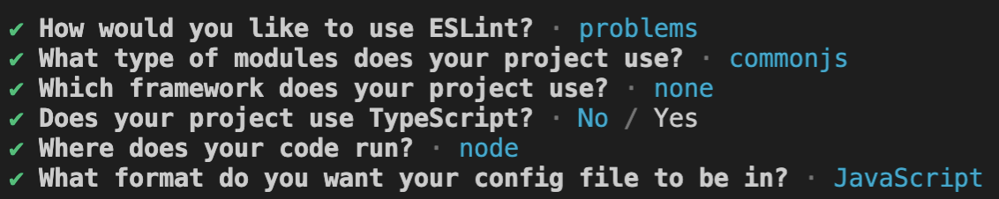
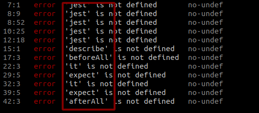

# Flujo de desarrollo del proyecto

<div class="embed-responsive">
  <iframe
    class="embed-responsive__item"
    src="https://www.youtube.com/embed/qCGqUXMqbnc"
    title="YouTube video player"
    frameborder="0"
    allow="accelerometer; autoplay; clipboard-write; encrypted-media; gyroscope; picture-in-picture" allowfullscreen
  ></iframe>
</div>

En el capítulo 3 creamos el monorepo con las partes Frontend y Backend que van a conformar nuestra plataforma pero no configuramos herramientas para el manejo global del proyecto.
En el capítulo 3 creamos el monorepo con las partes Frontend y Backend que van a conformar nuestra plataforma, pero no configuramos herramientas para el manejo global del proyecto.

Implementaremos una forma de revisión estática ó -*linting*- del proyecto global. Esta revisión estática del código ayuda a no introducir patrones problemáticos o que incumple ciertas reglas definidas. En otras palabras ayudan a "estandarizar" el código de la aplicación al seguir guías de estilo y reglas.

>Como aprendimos en el curso, Javascript al ser un lenguaje dinámico e interpretado, solamente *hoistea* el código antes de su ejecución, perdiendo esta ventaja que tienen los lenguajes compilados y tipados, como Java o la familia de lenguajes C (C#, C++), entre muchos otros, que hacen esta revisión estática del código durante la compilación.

En esta oportunidad vamos a configurar un script `pre-commit` que nos ayude a seguir prácticas recomendadas a través del análisis estático de la plataforma en su totalidad y otro de `pre-push` para asegurarnos que cada vez que se agrega código al repositorio central este siga guías de estilo, evite patrones problemáticos y no rompa ninguna de nuestras pruebas unitarias.

Iniciaremos este capítulo creando en la raíz del proyecto vamos un archivo package.json que nos permitirá gestionar dependencias globales de nuestra aplicación. Estas serán de utilidad para frontend y backend u algún otro componente que venga después:

```bash
.
├── backend
├── fixtures
└── frontend
.gitignore

```

Podemos generar una plantilla ejecutando:

```bash
npm init -f
``` 
Esto creará un archivo como el que se muestra a continuación. 

```javascript
{
  "name": "<nombre-de-tu-proyecto>",
  "version": "1.0.0",
  "description": "",
  "scripts": {
    "test": "echo \"Error: no test specified\" && exit 1"
  },
  "keywords": [],
  "author": "",
  "license": "ISC"
}
```
Notar que no usaremos la propiedad `main`, por lo que la eliminamos del archivo.

Instalaremos los paquetes necesarios con el siguiente comando:

```bash
npm install husky npm-run-all
```

Con esto ahora tenemos `Husky` para correr scripts asociados a git y `npm-run-all` que ejecutará las tareas para el `frontend` y `backend` en simultáneo.

Necesitamos homologar las tareas de calidad de código, para eso nos está faltando algo: Necesitamos configurar el linter en Backend con el mismo "estándar" configurado por Vue-CLI para el Frontend.

### Configurar linter en el backend

Nos aseguramos de navegar hacia la carpeta `backend` y en su interior ejecutamos el siguiente comando:

```bash
npm install --save-dev eslint
```
Ahora modificaremos la sección `scripts` del archivo `backend/package.json` y vamos a exponer el comando `eslint` como se muestra en el siguiente trozo de código:

```javascript
"scripts": {
  "start": "nodemon src/server.js",
  "test": "jest --runInBand --coverage",
  "eslint": "eslint",
  "jest": "jest",
  "sequelize": "sequelize"
},
```

Ahora vamos a inicializar Eslint corriendo el siguiente comando:

```bash
npm run eslint -- --init
```

Se nos harán una serie de pregunta. Nos aseguraremos de contestarlas con las respuestas que muestra la siguiente imagen:




El archivo generado por Eslint debería haber quedado de la siguiente forma:

**backend/.eslintrc**

```javascript
module.exports = {
  "env": {
      "commonjs": true,
      "es2021": true,
      "node": true
  },
  "extends": "eslint:recommended",
  "parserOptions": {
      "ecmaVersion": 12
  },
  "rules": {
  }
};

```

Ahora agregaremos un nuevo script que será el encargado de ejecutar el linter para este proyecto. Volvemos a la sección `script` del archivo `backend/package.json` y debería verse de la siguiente forma:

```javascript
"scripts": {
  "start": "nodemon src/server.js",
  "test": "jest --runInBand --coverage",
  "lint": "eslint .",
  "eslint": "eslint",
  "jest": "jest",
  "sequelize": "sequelize"
},
```

Ahora podremos ejecutar el siguiente comando desde la raíz del directorio backend:

```bash
npm run lint
```

Al ejecutar el comando podremos ver todos los errores asociados al estándar que estamos siguiendo con Eslint, pero también veremos otros errores que están relacionados al Framework para pruebas que estamos usando: Jest.
Estos errores se ven como se muestra en la siguiente imagen:



Esto sucede porque el estándar por defecto que instalamos con Eslint no viene preparado para ver los archivos de Jest. Para esto instalaremos un plugin de Eslint con el siguiente comando ejecutado en la raíz del directorio `backend`:

```bash
npm i --save-dev eslint-plugin-jest
```

y reemplazamos el contenido del archivo `backend/.eslintsrc` con el siguiente contenido:

```javascript
module.exports = {
  "env": {
    "commonjs": true,
    "es2021": true,
    "node": true,
    "jest/globals": true
  },
  "extends": "eslint:recommended",
  "plugins": [
    "jest"
  ],
  "parserOptions": {
    "ecmaVersion": 12
  },
  "rules": {
  }
};

```

Con esta configuración ya somos capaces de corregir los errores que nos indique Eslint sin problemas corriendo el comando `npm run lint`.

Una vez que solucionemos todo los problemas y guardemos los archivos que hemos debido modificar para pasar el linter del lado `backend`, iremos a la carpeta `frontend` y estando en la raíz de este directorio ejecutaremos:

```bash
npm run lint
```

Ahora revisamos si es que existen archivos que tengan problemas. De ser así solucionamos los problemas y guardamos los archivos.

### Scripts de pre-commit y pre-push para el proyecto

Volveremos a la raíz del proyecto e iremos al archivo `package.json` y modificaremos la sección scripts para que quede de la siguiente manera:

```javascript
"scripts": {
  "frontend-test:unit": "cd frontend && npm run test:unit",
  "frontend-lint": "cd frontend && npm run lint",
  "backend-lint": "cd backend && npm run lint",
  "backend-test": "cd backend && npm test",
  "pre-commit": "npm-run-all frontend-lint backend-lint",
  "pre-push": "npm-run-all frontend-test:unit backend-test",
  "husky": "husky"
},

```

Podemos probar estos scripts primero corriendo los comandos

```bash
npm run pre-commit
```

y luego 

```bash
npm run pre-push
```

Deberíamos a estas alturas tener todos los linter tanto de Frontend como Backend pasando, así como las pruebas unitarias.

Nos queda un último paso que sería que estos scripts se activen cada vez que hacemos commit o push de nuestro código.

### 

Instalar husky
```bash
npm run husky install
```

Veras que se configuro una nueva carpeta en la raíz llamada `.husky`
Ahora ejecutaremos lo siguiente:

```bash
npm run husky add .husky/pre-commit "npm run pre-commit"
npm run husky add .husky/pre-push "npm run pre-push"
```

ahora veremos que dentro del directorio llamado `.husky` hay 2 nuevos archivos. Si revisamos su interior deberíamos ver lo siguiente:

**.husky/pre-commit**

```bash
#!/bin/sh
. "$(dirname "$0")/_/husky.sh"

npm run pre-commit

```

**.husky/pre-push**

```bash
#!/bin/sh
. "$(dirname "$0")/_/husky.sh"

npm run pre-push

```

Ahora podemos probar que todo esta funcionando.
Primero haremos un commit y veremos como es que se corren los linters de los proyectos Frontend y Backend.

```bash
git add .
git commit -m "chore(dev-scripts): se agregaron scripts de pre-commit y pre-push para asegurar la calidad de la plataforma"
```

Veremos como al hacer esto se corre el script `pre-commit`. Si todo salió bien el commit debería hacerse sin problemas.


Ahora crea un repositorio remoto en Github, agregalo al proyecto y envía el primer push para ver que ahora también se ejecutan las pruebas.

al final
```bash
git push origin main
```

veremos como corren las pruebas antes de que se haga la subida del código a tu repositorio remoto.

Ya estamos preparados para subir a producción nuestro proyecto en el siguiente capítulo.

