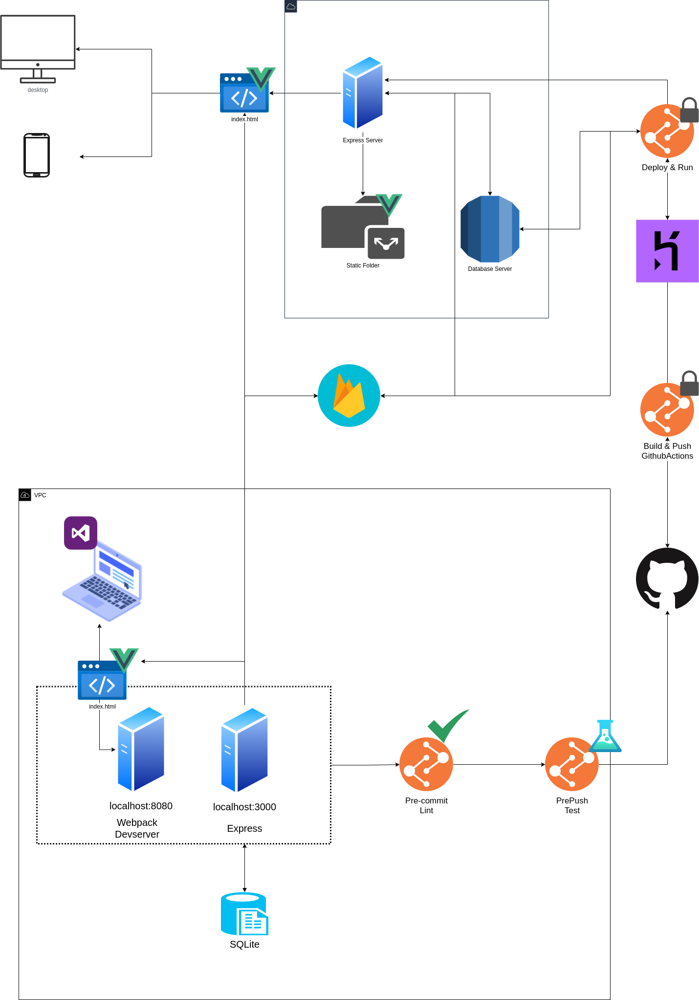
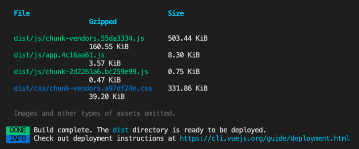

# Salida a producción utilizando Github Actions y Heroku

<!-- <div class="embed-responsive">
  <iframe
    class="embed-responsive__item"
    src="https://www.youtube.com/embed/r2SFEk8ee38"
    title="YouTube video player"
    frameborder="0"
    allow="accelerometer; autoplay; clipboard-write; encrypted-media; gyroscope; picture-in-picture" allowfullscreen
  ></iframe>
</div> -->

En estos capítulos hemos intentado plasmar que el desarrollo ágil de aplicaciones es un *proceso* iterativo, de mucha comunicación, trabajo en equipo y siempre preparados para el cambio. Es por esto que debemos incorporar principios de diseño y técnicas de refactorización para adaptar la aplicación a los diferentes escenarios. Pero salir a producción es la razón de nuestro trabajo. Salir a producción con nuevas funcionalidades en forma frecuente es lo que mantendrá a nuestros activos digitales entregando valor. Desde el principio debemos velar por tener siempre un proceso de salida a producción lo más límpio y flexible al igual que el código.

## Arquitectura y Deploy

En esta oportunidad utilizaremos el enfoque de WEB SERVER + API en el mismo servidor NodeJS. Esto quiere decir que debemos incluir una carpeta en el servidor que contendrá en resultado del proyecto Frontend, esto es, un archivo index.html con los archivos Javascript y CSS, así como los recursos como imágenes e íconos. De esta forma las peticiones hechas por la parte Frontend hacia el Backend utilizarán el mismo dominio y no tendremos que configurar CORS en nuestro servidor.

La siguiente imagen muestra un diagrama que intenta explicar el proceso de despliegue y sus componentes.



Para logra esto haremos 2 pasos:

1. Generar un proyecto Frontend listo para poner en producción
2. Agregar una carpeta pública en el proyecto Backend y el código necesario para exponerla a través de Express.

## Generar un proyecto Frontend listo para poner en producción

Para lograr esto ingresaremos a la carpeta `frontend` a través de la terminal y correremos el siguiente comando:

```bash
npm run build
```
Deberíamos ver algo como lo que muestra la siguiente imagen:



Veremos aparecer una carpeta `dist` en la raíz del directorio `frontend` por lo cuál si accedemos a ella veremos los archivos generados por Vue además de un archivo `index.html` y `favicon.ico`. 


**backend/src/app.js**
```javascript

const express = require('express')
const authMiddleware = require('./middleware/auth')
const routes = require('./routes')
const staticFolder = `${__dirname}/public`
const app = express()

app.use(express.static(staticFolder))
app.use('/api', authMiddleware)
app.use('/api', routes)

app.get('*', (request, response) => {
  return response.sendFile(`${staticFolder}/index.html`)
})

module.exports = app

```

- copiar todo el contenido de dist a `backend/src/public`

- correr `npm run dev` en backend

- Agregar al gitignore

```bash
backend/src/public
```

- agregar al gitignore `backend/public` y explicar porque


### ¿Qué método de puesta en producción en servidores en la nube utilizaremos?

- heroku crear cuenta

- heroku crear app interfáz

- agregar tarea `start` y sección `engines`

**backend/package.json**
```javascript
{
  "name": "backend",
  "version": "1.0.0",
  "description": "",
  "engines": {
    "node": "12.x"
  },
  "scripts": {
    "start": "node src/server.js",
    "dev": "nodemon src/server.js",
    "test": "jest --runInBand --coverage",
    "eslint": "eslint",
    "lint": " eslint .",
    "jest": "jest",
    "sequelize": "sequelize"
  },
  "keywords": [],
  "author": "",
  "license": "ISC",
  "dependencies": {
    "express": "^4.17.1",
    "firebase-admin": "^9.6.0",
    "sequelize": "^6.6.2"
  },
  "devDependencies": {
    "eslint": "^7.24.0",
    "eslint-plugin-jest": "^24.3.6",
    "jest": "^26.6.3",
    "jest-cli": "^26.6.3",
    "nodemon": "^2.0.7",
    "sequelize-cli": "^6.2.0",
    "sqlite3": "^5.0.2",
    "supertest": "^6.1.3"
  }
}

```

nos basta la tarea `start` para que heroku reconozca que este será el comando de inicialización. Puedes revisar sobre esta información en la documentación oficial de Heroku a través de [este enlace](https://devcenter.heroku.com/articles/nodejs-support#default-web-process-type)

Es también importante configurar la sección `engines` para confifgurar bajo que versión de NodeJS correrá nuestra aplicación. Más detalles en el siguiente [enlace](https://devcenter.heroku.com/articles/nodejs-support#specifying-a-node-js-version)

## ¿Que requisitos debe cumplir el código fuente para salir a producción desde este punto en adelante?

- Github actions y variables de ambiente para deployment y seguridad en settings/secrets

  HEROKU_APP_NAME
  HEROKU_OWNER_EMAIL
  HEROKU_API_KEY

- crear carpeta `.github` en la raíz. dentro otra carpeta llamada `worflows` y ahi dentro un archivo llamado `pipeline.yml` como muestra el siguiente esquema:

```
└─ .github
  └─ worflows
     pipeline.yml
└─ .husky
└─ backend
└─ fixtures
└─ frontend
.gitignore
package-lock.json
package.json
```

**.github/workflows/pipeline.yml**

```yaml
name: Node.js CI
on:
  push:
    branches:
      - main
jobs:
  build:
    runs-on: ubuntu-latest
    container:
      image: node:12
    steps:
        - name: Checkout code
          uses: actions/checkout@v2
        - name: Build Deploy Artifact
          run: |
            STATIC_FOLDER=backend/src/public
            cd ./frontend
            npm install
            npm run build
            cd ..
            mkdir -p $STATIC_FOLDER
            cp -R ./frontend/dist/. $STATIC_FOLDER
            ls -R -lha $STATIC_FOLDER
        - name: Archive production artifact
          uses: actions/upload-artifact@v2
          with:
            name: platform-artifact
            path: |
              backend
              !backend/tests
              !backend/.eslintrc.js
              !backend/jest.config.js
              !backend/nodemon.json
  deploy:
    runs-on: ubuntu-latest
    needs: build
    env:
      HEROKU_APP_NAME: ${{ secrets.HEROKU_APP_NAME }}
      HEROKU_OWNER_EMAIL: ${{ secrets.HEROKU_OWNER_EMAIL }}
      HEROKU_API_KEY: ${{ secrets.HEROKU_API_KEY }}
    steps:
        - name: Download production artifact
          uses: actions/download-artifact@v2
          with:
            name: platform-artifact
            path: backend
        
        - name: Setup Heroku Credentials
          run: |
            cat > ~/.netrc <<EOF
            machine api.heroku.com
              login $HEROKU_OWNER_EMAIL
              password $HEROKU_API_KEY
            machine git.heroku.com
              login $HEROKU_OWNER_EMAIL
              password $HEROKU_API_KEY
            EOF
            cat ~/.netrc

        - name: Deploy Platform to Production
          run: |
            cd backend
            git init
            git branch -m main
            git config user.email "deployment-user@github-actions"
            git config user.name "Deployment Bot"

            git remote add heroku https://git.heroku.com/$HEROKU_APP_NAME.git
            echo 'node_modules' >> .gitignore

            git add .
            git commit -m "deploy: server artifact deployment from github actions"
            git push -f heroku main

```
- Pull request, code review y agilidad etc
- push y mirar todo el proceso de puesta en producción con la interfaz de Github Actions
- push FALLA al mirar nuestra app en producción esta fallando.

Para saber que pasó, en la raíz:

```bash
npm install heroku
```

```bash
npm run heroku logs -- --app=<nombre-de-tu-app>
```

FALLA!
PORQUE SEQUELIZE NO RECONOCE LA CONFIGURACIÓN PARA PRODUCCIÓN FOTO


### ¿Qué tipo base de datos y servicio en la nube para almacenar datos utilizaremos?

- instalar postgres como dependencia del backend

en `backend` en la raíz:

```bash
npm install pg
```

- heroku agregar ADDON Heroku Postgres interfaz

`heroku-postgresql`

- revisar config vars y veremos DATABASE_URL que usaremos más adelante
- configurar sequelize para producción usando 
```javascript
"production": {
  "use_env_variable": "DATABASE_URL",
  "dialect": "postgres",
  "dialectOptions": {
    "ssl":{
      "rejectUnauthorized": false
    }
  },
  "logging": false
}
```

Ahora


```bash
npm run heroku logs -- --app=<nombre-de-tu-app>
```

FALLA! DEBEMOS INCLUIR SERVICE-ACCOUNT

crear archivo `.profile`
la información de porque creamos este archivo está en el siguiente [enlace](https://devcenter.heroku.com/articles/dynos#the-profile-file)

**backend/.profile**
```
OUTPUT_PATH="$(pwd)/firebase-service-account.json"

curl -X GET \
  -o $OUTPUT_PATH \
  $SERVICE_ACCOUNT_FILE_URL

export GOOGLE_APPLICATION_CREDENTIALS=$OUTPUT_PATH
```

- Interfaz de firebase foto sacar URL

- Ir a config vars de Heroku y crear SERVICE_ACCOUNT_FILE_URL.
Ahora deberían haber 2: DATABASE_URL y SERVICE_ACCOUNT_FILE_URL.
Además mencionar la varianble PORT que lo puedes ver más en detalle en el siguiente [enlace](https://devcenter.heroku.com/articles/dynos#local-environment-variables)

Ahora somos capaces de generar el archivo de cuenta de servicio de manera segura a través de la variable GOOGLE_APPLICATION_CREDENTIALS

OTRA VEZ 

hacer push y listo

AHORA SI FUNCIONA!!!! pero la tabla productos está vacia.
Mostrar foto array vacio en el response del endpoint de productos


Ahora hacemos push, esperamos el deploy!
autenticamos
y vemos error 500 en la DB "no existe tabla productos"
NOS FALTAN LAS MIGRACIONES

agregar scripts `db:migrate` y `heroku-postbuild` a `backend/package.json`

```javascript
"db:migrate": "npm run sequelize db:migrate",
"heroku-postbuild": "npm run db:migrate -- --env=production"
```

Utilizamos `heroku-postbuild` ya que en esta etapa podemos utilizar las dependencias de desarrollo ya que antes de la publicación Heroku elimina las dependencias de desarrollo.

para saber más sobre los scripts que puede correr heroku utilizando las config vars seteadas en al interfaz puede ver más detalle en el siguiente [enlace](https://devcenter.heroku.com/articles/nodejs-support#heroku-specific-build-steps)


---


### Cargar datos en la base de datos y ver los productos


### Agregar un usuario real a la aplicación para terminar

