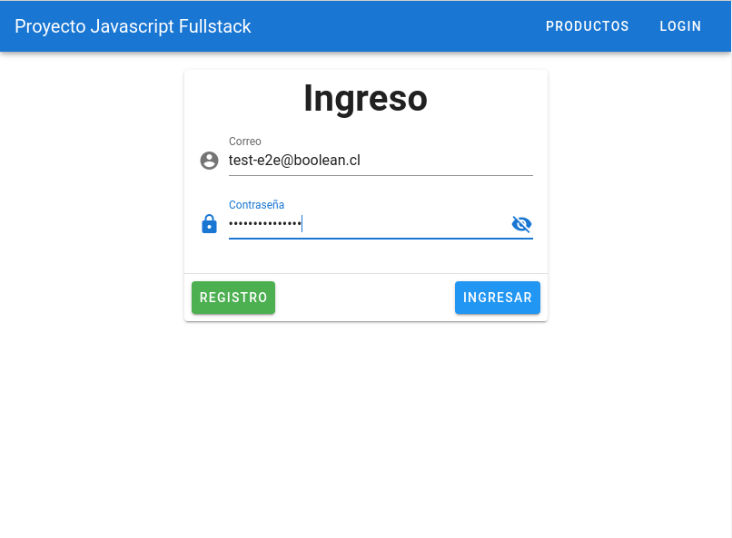
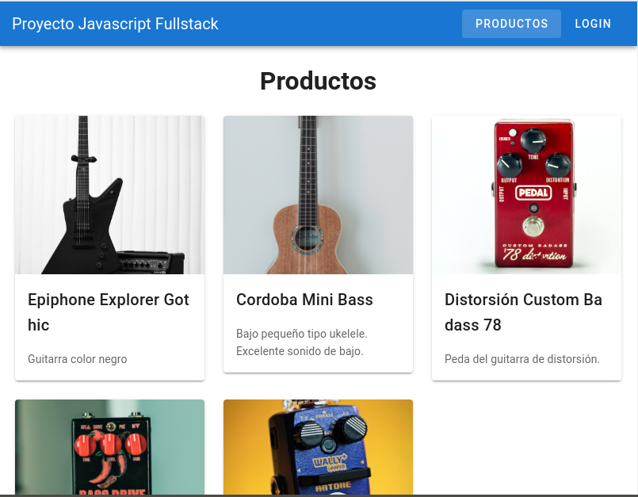

# Proyecto de desarrollo ágil: Aplicación Fullstack Javascript 

Hola! Bienvenidos al proyecto final del curso [Fullstack Javascript para programadores](https://boolean.cl/courses/javascript-full-stack-basic). Crearemos un producto digital aplicando los conocimientos del curso más la metodología de desarrollo ágil utilizando Javascript en todo el stack. Usaremos técnicas de refactorización que permiten solucionar bugs y refactorizar el proyecto de forma sostenible para entregar valor en iteraciones rápidas. 

**Con esta guía el estudiante podrá:**

  1)  Poner en producción el resultado de un (mini) **sprint** que será la base para su futura personalización y proyecto final del curso. 
  2)  Practicar técnicas para trabajar con aplicaciones *legacy* mediante pruebas. 
   
**Advertencia**
> La elección de los frameworks y plataformas se hizo considerando alta productividad con baja curva de aprendizaje para enfocarnos en el uso del lenguaje Javascript en un proceso de desarrollo Ágil. En Boolean creemos que la metodología de desarrollo es tanto o más importante que las tecnologías o frameworks. En otras palabras, la metodología usada en esta guía aplica a cualquier combinación de frameworks o librerías Javascript (React, Angular, Koa, etc).    

En concreto vamos a construir la base de una aplicación escalable y flexible utilizando Javascript siguiendo la metodología **BDD** para implementar 2 **Historias de usuario**. En el Frontend usaremos la dupla **VueJS**/**Vuetify** más los *plugins* **Vue-Router** y **Vuex** para construir una Single Page Application (SPA), mientras que en el Backend construiremos un servidor **NodeJS** con la librería **Express**. La autenticación en todo el stack será implementada usando el servicio de **Firebase**. La aplicación será publicada en la plataforma **Heroku** con un proceso de despliegue en **Github actions**. Con esta arquitectura las **soluciones** podrán consumir a futuro servicios de **Firebase** y/o **Heroku**.

Manos a la obra!
